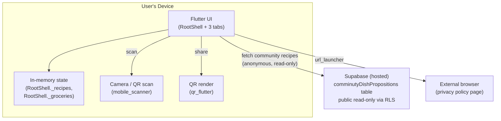

# My Food This Week — Project Documentation

_Generated from a full read of the repository. Updated after Supabase integration was added for community recipes (commit `3eaa1f3`, "community dataset integrated in supabase")._

> This document describes the codebase **as it actually exists today**. Anything that could not be verified from the code is explicitly labeled `Unknown / Not determinable from the codebase`.

---

## 1. Executive Summary

**My Food This Week** (package name `eating_app`, app title set at runtime to "My Food This Week") is a **local-first Flutter mobile app** for planning meals and generating grocery lists. Users create recipes with manually-entered nutrition totals (calories, protein, carbs, fat), browse a set of curated "community" recipes, generate a shopping list from selected recipes, and share recipes device-to-device via QR code.

The app was previously fully offline. It now makes **one backend call**: community recipes are fetched anonymously and read-only from a hosted **Supabase** Postgres table instead of being hardcoded in Dart (see §6a and §20). There is still **no backend for user-created recipes, no accounts, and no login** — the app has no user identity of any kind. Aside from the community-recipe fetch and opening a static privacy-policy web page, there are no other network calls.

Earlier in the project's history, an automatic nutrition-calculation engine that matched free-text ingredients against a bundled French CIQUAL food-composition database was removed entirely (see §20). Nutrition values are entered manually per recipe, the same way community recipes are defined.

The most significant remaining functional gap is that **user-created recipes and the grocery list are not persisted to disk** — they live only in in-memory widget state and are lost on app restart. This predates the Supabase change and is unaffected by it.

**Security note**: the Supabase anon/publishable key is hardcoded and committed in `.vscode/launch.json`, even though the app's own `SupabaseConfig` is designed to source it via `--dart-define` specifically to avoid committing it. See §14 and §22.

No Dolby-licensed code or references exist anywhere in the repository.

---

## 2. Product Overview

- **Platform**: Flutter (Android, iOS, plus generated Linux/macOS/Windows/web scaffolding — only Android/iOS appear actively targeted).
- **Purpose**: help a user assemble a personal recipe collection with manually-tracked nutrition, build a shopping list from selected recipes, and share recipes with other users via QR code.
- **Data source**: no nutrition-calculation database of any kind (removed, see §20). Nutrition numbers are either typed in by the user or come from the community-recipe rows fetched from Supabase.
- **Audience**: individual/household users; no multi-user, team, or account concept exists.
- **Bundled/remote content**: ~50 curated "community" recipes, now served from a Supabase table (`comminutyDishPropositions`) rather than hardcoded, each with fixed nutrition values and a thumbnail image (local asset paths currently; a migration to Supabase Storage URLs appears intended but not yet wired into the UI — see §6a).

---

## 3. Feature Inventory

### 3.1 Recipe Management

**Purpose**: create, edit, browse, and delete personal recipes with user-entered nutrition totals.

**User story**: As a user, I can add a recipe with a name, meal type, portions, ingredients, and nutrition totals, so I can track what I plan to eat.

**How it works**: Recipes are created via a dialog on the Recipes tab. Ingredients are entered as plain name + quantity text pairs — there is no automatic food lookup or nutrition calculation. Calories/protein/carbs/fat totals for the recipe are entered directly by the user (mirroring how community recipes are defined).

**User flow**:
1. User opens the Recipes tab (`RecipesTab`).
2. User taps "add recipe" → dialog opens (`lib/features/recipes/presentation/screens/recipes_tab.dart`).
3. User enters name, meal type, portions, nutrition totals, and one or more ingredients (plain text fields for name + quantity).
4. User optionally attaches a photo via `image_picker`.
5. On save, the recipe is appended to `RootShell._recipes` (in-memory list).
6. User can view recipe details, edit, or delete a recipe.

**UI**: `RecipesTab` (search bar, filter panel via `RecipeFilterPanel`, recipe cards with `StatChip`s for calories/protein/portions, `RecipePhoto` thumbnail, `EmptyState` when no recipes match). Add/edit dialog with plain ingredient rows and numeric nutrition fields.

**Backend**: All logic runs in-process in Dart — no server. Key files: `lib/features/recipes/presentation/screens/recipes_tab.dart`, `lib/features/recipes/domain/entities/recipe.dart`, `lib/features/recipes/domain/entities/ingredient.dart`.

**API**: None.

**Database**: None. Recipes are not written to any database or file — see §16 Known Limitations.

**Dependencies**: `image_picker`.

**Permissions & Security**: No auth/accounts. Photo access requires OS camera/photo-library permission (declared in `docs/privacy-policy.md`).

**Edge cases**: empty/blank ingredient rows, missing nutrition values default to unset rather than a computed guess (no calculation happens at all now).

**Tests**: none identified specific to recipe CRUD beyond the general widget smoke test.

**Known limitations**: Recipes are lost on app restart (no persistence layer). `recipes_tab.dart` remains a large file mixing UI, state, and dialog logic.

---

### 3.2 Grocery List Generation

**Purpose**: turn a set of selected recipes into a deduplicated, quantity-combined shopping list.

**User story**: As a user, I can select recipes and generate a grocery list so I know what to buy, with matching ingredients across recipes automatically combined.

**How it works**: `RootShell._addToGroceries`/`_generateGroceries` (`lib/app/root_shell.dart`) iterate the chosen recipes' ingredients, dedupe by lowercased name, and combine raw quantity strings via `combineQuantities()` (`lib/features/groceries/domain/usecases/combine_quantities.dart`) — a regex-based summation (`^([\d.]+)\s*(.*)$`) that adds numeric amounts sharing the same unit string (e.g. "2 cups" + "1 cups" → "3 cups") and joins mismatched/non-numeric quantities with `" + "`. After generation the app switches to the Groceries tab.

**UI**: `GroceriesTab` (`lib/features/groceries/presentation/screens/groceries_tab.dart`) — `CheckboxListTile` per item with strike-through when checked, reset-all button behind a confirmation dialog, `EmptyState` when the list is empty.

**Database**: None — grocery items live only in `RootShell._groceries` (in-memory `List<GroceryItem>`), same persistence gap as recipes.

**Edge cases**: quantities with mismatched units are not merged numerically, just concatenated as text (e.g. "2 cups + 200 g").

**Known limitations**: not persisted; combination logic is a naive regex, not unit-aware.

**Tests**: none identified.

---

### 3.3 Community Recipes

**Purpose**: give users a ready-made, curated set of recipes to browse and optionally add to their own collection without having to author anything.

**User story**: As a user, I can browse ~50 pre-made recipes and add any of them to my personal list.

**How it works**: `fetchCommunityRecipes()` (`lib/features/recipes/data/community_recipes_remote_data_source.dart`) queries the Supabase table `comminutyDishPropositions` anonymously (`supabase.from('comminutyDishPropositions').select()`) and maps each row to a `Recipe` via the new `Recipe.fromSupabaseRow()` factory (`lib/features/recipes/domain/entities/recipe.dart`). `CommunityTab` calls this in `initState`, showing a loading spinner while awaiting and, on failure, an `EmptyState` displaying the raw exception text. See §6a for the full backend picture.

**User flow**:
1. User opens the Community tab (`CommunityTab`) → recipes are fetched live from Supabase.
2. Browses/searches/filters (reusing `RecipeFilterPanel` and `RecipeFilter`).
3. Taps a recipe to view details.
4. Taps "add to my recipes" → appends an independent copy (`recipe.copy()`) to the user's in-memory recipe list via `RootShell._addRecipe`.

**Database**: Supabase Postgres table `comminutyDishPropositions`, public read-only via RLS (see §6a, §10a). No local database.

**Known limitations**:
- ~~Dead code: `community_recipes.dart`~~ — **fixed**: the old hardcoded ~975-line `communityBreakfastRecipes()` list has been deleted now that it's superseded by the Supabase fetch. The Supabase seed data (`supabase/seed/community_recipes.*`) remains as the historical export of that list, used to populate the live table.
- Adding a new community recipe now means inserting a row into Supabase (via the dashboard, SQL, or the seed scripts) rather than editing Dart and rebuilding — an improvement over the old hardcoded-list workflow, but there is no in-app or CI-driven way to do this yet; it's manual/out-of-band.
- No offline fallback: if the Supabase fetch fails (no network, RLS misconfiguration, etc.), the Community tab shows only a raw error message, with no cached/bundled fallback list.
- Table-name inconsistency in the surrounding tooling: the app and `supabase/schema.sql` agree on `comminutyDishPropositions`, but `supabase/seed/push_community_recipes.py` (and a stray code comment) target a differently-spelled `community_recipies` — this should be reconciled so the seeding script actually targets the live table.

---

### 3.4 Recipe Filtering & Search

**Purpose**: let users narrow recipes (personal or community) by nutrient ranges and meal type.

**How it works**: `RecipeFilter` (`lib/features/recipes/domain/entities/recipe_filter.dart`) holds `NutrientRange` bounds for calories/protein/carbs/fat, plus a `mealTypes` set. `recipeMatchesFilter()` applies all criteria directly against each recipe's own totals (`recipe.calories`, `recipe.protein`, `recipe.carbs`, `recipe.fat`) — there is no per-ingredient summation anymore, since ingredients no longer carry nutrition data. Fiber range filtering was removed (no field left to filter on).

**UI**: `RecipeFilterPanel` (`lib/features/recipes/presentation/widgets/recipe_filter_panel.dart`) — shared between Recipes and Community tabs.

---

### 3.5 Recipe Sharing (QR Code)

**Purpose**: let a user share one or more recipes with another user of the app without any backend, by encoding them into a QR code.

**User story**: As a user, I can select recipes and generate a QR code so another user can scan it with their app and import those recipes.

**How it works**:
- **Encoding** (`RecipeShareCodec.encode`, `lib/features/sharing/domain/recipe_share_codec.dart`): `jsonEncode({'recipes': [...]})` → `gzip.encode` → `base64Url.encode` → a single text payload.
- **Display** (`ShareRecipesScreen`): renders the payload as a QR code (`qr_flutter`) and offers a "Share" button that opens the OS share sheet with the raw text payload via `share_plus`.
- **Scanning** (`ScanRecipesScreen`): uses `mobile_scanner`'s live camera view; `_onDetect()` decodes the scanned QR value via `RecipeShareCodec.decode` and pushes `ImportRecipesScreen`.
- **Import** (`ImportRecipesScreen`): checklist of decoded recipes (all pre-selected by default), user confirms selection, selected recipes are appended to the receiver's in-memory recipe list.

**Database**: None — pure in-memory encode/decode.

**Dependencies**: `qr_flutter`, `mobile_scanner`, `share_plus`.

**Permissions & Security**: Scanning requires camera permission. No encryption — the payload is gzip+base64, not encrypted. No sender-identity validation.

**Edge cases**: invalid/corrupt payload → `RecipeShareCodec.decode` throws `FormatException`. Recipe photo paths are nulled on import (`Recipe.fromJson`) since they can't resolve on the receiving device's filesystem.

**Tests**: none identified.

**Known limitations**: no dedicated test coverage for the sharing feature.

---

### 3.6 Localization (English / French)

**Purpose**: support English and French UI text.

**How it works**: Standard Flutter `gen-l10n` codegen (`l10n.yaml`, `flutter: generate: true` in `pubspec.yaml`) from `lib/l10n/app_en.arb` (canonical/template) and `lib/l10n/app_fr.arb`. English has more keys than French — some newer strings may lack French translations. Some ARB keys tied to the now-removed nutrition/matching UI may be unused; not cleaned up.

**Known limitations**: possible incomplete French coverage; possible small number of dead ARB keys left over from the nutrition feature removal.

---

## 4. User Roles & Permissions

There is **no authentication, account, or role system** in this application. The app has a single implicit "user" — the device owner. All data is local to the device; sharing is peer-to-peer via QR code, not account-based. This matches `docs/privacy-policy.md` ("does not require or support accounts").

---

## 5. Major User Flows

### 5.1 App Launch
1. `main()` (`lib/main.dart`) initializes Flutter bindings and calls `runApp(const MyApp())` directly — no database bootstrap, no provider setup.
2. `MyApp` builds a `MaterialApp` (Material 3 theme, `AppPalette` seed colors, Georgia font, EN/FR localization) with `home: RootShell()`.
3. `RootShell` renders a 3-tab `NavigationBar` (Recipes / Groceries / Community) over an `IndexedStack`.

### 5.2 Create a Recipe → Generate Grocery List
See §3.1 and §3.2 — manual recipe entry, then selecting recipes to merge ingredients into the Groceries tab.

### 5.3 Share Recipes Device-to-Device
See §3.5 — full sender/receiver QR flow.

### 5.4 Browse & Adopt a Community Recipe
See §3.3.

No registration, login, password-reset, payment, subscription, notification, email, or admin workflows exist in this codebase.

---

## 6. Application Architecture



- **Frontend architecture**: single Flutter app, feature-folder layout (`lib/features/{recipes,groceries,sharing}`).
- **State management**: plain `StatefulWidget`/`setState` throughout. No Riverpod or other state-management package dependency.
- **Backend**: Supabase (hosted Postgres + auto-generated REST API), used *only* to serve community recipes anonymously and read-only. No custom server, no Edge Functions found, no other API.
- **Database**: no local database. Remotely, a single Supabase Postgres table (`comminutyDishPropositions`) backs community recipes — see §6a and §10a. User recipes/groceries are still not persisted anywhere.
- **Caching**: none — community recipes are re-fetched every time the Community tab loads.
- **Background jobs / queues / scheduled tasks**: none.
- **Logging / monitoring**: none (no analytics, no crash reporting SDKs in `pubspec.yaml`).
- **Error handling**: exceptions surface as thrown Dart exceptions (e.g. `FormatException` in the share codec, raw exception text shown in the Community tab on fetch failure); no centralized error-reporting mechanism.

---

## 6a. Supabase Integration

**Purpose**: serve the curated community-recipe catalog from a live backend instead of a hardcoded Dart list, without introducing accounts or user data collection.

**Dependency**: `supabase_flutter: ^2.8.0` (the only backend-related package added; no other auth/database packages).

**Client setup** — `lib/core/supabase/supabase_config.dart`:
```dart
class SupabaseConfig {
  static const String url = 'https://bipjodhqsldkyjoecrix.supabase.co';
  static const String anonKey = String.fromEnvironment('SUPABASE_ANON_KEY');
  static Future<void> initialize() async {
    if (anonKey.isEmpty) {
      throw StateError('Missing SUPABASE_ANON_KEY. Run with --dart-define=SUPABASE_ANON_KEY=<your-anon-key>.');
    }
    await Supabase.initialize(url: url, anonKey: anonKey);
  }
}
```
- The project URL is hardcoded (not sensitive on its own). The anon/publishable key is intentionally **not** hardcoded here — it's read via `--dart-define` precisely to avoid committing it.
- `lib/main.dart` calls `await SupabaseConfig.initialize()` before `runApp`, replacing the old local-database bootstrap.
- **Contradiction found**: `.vscode/launch.json` (tracked in git) hardcodes the real key in its default debug launch config (`--dart-define=SUPABASE_ANON_KEY=sb_publishable_...`). This is a "publishable" key (Supabase's newer key format, RLS-protected and meant to be public-safe), but committing it still defeats the pattern `SupabaseConfig` was written to enforce, and should be moved out of a tracked file. See §22.

**What it's used for**: exactly one read path — `fetchCommunityRecipes()` (§3.3). No writes, no auth, no user-specific queries originate from the app.

**Backend schema** (`supabase/schema.sql`, not a full Supabase CLI project — no `config.toml`/local Docker scaffold, just hand-authored SQL run against the hosted project):
- Table `public."comminutyDishPropositions"`: `id uuid` (PK), `owner_id uuid references auth.users(id)`, `name text`, `calories int`, `protein int`, `carbs int?`, `fat int?`, `portions int default 1`, `meal_type text` (CHECK in breakfast/lunch/dinner/snack/drink), `photo_path text`, `description text`, `ingredients jsonb`, `is_community boolean default false`, `created_at timestamptz`.
- **Row Level Security** is enabled with 5 policies: public `SELECT` where `is_community = true`; an owner can `SELECT`/`INSERT`/`UPDATE`/`DELETE` their own rows (`auth.uid() = owner_id`).
- The owner/RLS design clearly anticipates a future where authenticated users can own private recipes server-side — but **no such feature is wired into the app today**; it's schema-level groundwork only, unused by any current screen.

**Seed data** (`supabase/seed/`): `community_recipes.json`/`.sql`/`.csv` — the same ~50 recipes, generated from the old hardcoded Dart list, plus `push_community_recipes.py` (stdlib-only Python script using a `SUPABASE_SERVICE_ROLE_KEY` env var to POST rows via the REST API). Two inconsistencies to be aware of:
1. The Python push script and one code comment target a table named `community_recipies`, while the schema and the app both use `comminutyDishPropositions` — likely a stale/renamed reference in the script, not in the running app.
2. `community_recipes.csv` stores `photo_path` as full Supabase Storage URLs, while the app's `Recipe.photoPath` handling still assumes local asset paths — a Storage-based photo migration looks intended but isn't yet reflected in the Flutter UI code.

**Auth status**: no login, session, or user-identity code exists anywhere in `lib/` (confirmed by grep) — the app performs only anonymous, public reads. The `auth.users`/RLS ownership design in the schema is forward-looking infrastructure, not an active feature.

---

## 7. Repository Structure

```text
lib/
├── app/root_shell.dart        # Top-level 3-tab shell, in-memory recipes/groceries state
├── core/
│   ├── supabase/                # SupabaseConfig — client init, url/anon key handling  [NEW]
│   ├── theme/                   # AppPalette (colors), AppTheme (light/dark ThemeData), AppColors (semantic colors)
│   └── widgets/                 # EmptyState, StatChip (shared UI)
├── features/
│   ├── groceries/               # Grocery list domain + Groceries tab UI
│   ├── recipes/
│   │   ├── data/                  # community_recipes_remote_data_source.dart (Supabase fetch)  [NEW]
│   │   ├── domain/                 # Recipe/Ingredient/RecipeFilter entities
│   │   └── presentation/           # Recipes/Community tabs, filter panel, recipe photo widget
│   └── sharing/                  # QR encode/decode + share/scan/import screens
├── l10n/                        # ARB source + generated AppLocalizations
└── main.dart                    # Entry point — now calls SupabaseConfig.initialize() before runApp

supabase/                          # Backend schema + seed data for the hosted Supabase project  [NEW]
├── schema.sql                       # comminutyDishPropositions table + RLS policies
└── seed/                            # community_recipes.{json,sql,csv} + push_community_recipes.py

assets/images/community_thumbnails/ # ~50 recipe thumbnails for community recipes (local assets; Supabase Storage URLs appear in seed data but aren't used by the app yet)
test/widget_test.dart              # Only remaining test — smoke test for the 3 nav tabs
docs/privacy-policy.md             # Published privacy policy
android/, ios/, linux/, macos/, windows/, web/  # Platform scaffolding (generated)
flutter_build/                     # STALE duplicate/default Flutter scaffold — not the real app, ignore
```

Everything under `flutter_build/` is a leftover default Flutter counter-app template — not part of the shipped application.

**Removed in the nutrition-feature cleanup** (previously documented, no longer present): `lib/features/nutrition/`, `lib/core/database/`, `lib/core/units/`, `lib/core/text/`, `assets/db/nutrition.db`, `food_bd/`, `tool/community_dev/`, and all nutrition-engine test files.

---

## 8. Frontend Architecture

- **Entry**: `lib/main.dart` → `MyApp` → `RootShell` (`lib/app/root_shell.dart`).
- **Navigation**: no router package; a single `IndexedStack` switched by a `NavigationBar`, tab index held in `RootShell._tabIndex` (`setState`). Sub-screens (share/scan/import) are pushed via standard `Navigator.push`.
- **Theming**: `AppPalette` (`lib/core/theme/app_palette.dart`) defines a pastel Material 3 seed palette; Georgia font family throughout.
- **Reusable widgets**: `EmptyState`, `StatChip` (`lib/core/widgets/`); feature-specific widgets like `RecipePhoto`, `RecipeFilterPanel`.
- **Forms/dialogs**: recipe add/edit is an in-place dialog inside `RecipesTab`, not a separate route.

---

## 9. Backend Architecture

No custom backend server. Community recipes are served by **Supabase's auto-generated REST API** over a single Postgres table (§6a), queried anonymously and read-only — there is no Edge Function, no custom endpoint, no server code written for this project. All other logic is Dart code executed on-device, primarily in `lib/features/recipes/domain/`, `lib/features/groceries/domain/`, and `lib/features/sharing/domain/`. No background processing, isolates, workers, or job queues exist.

---

## 10. Database & Data Model

**No local database.** The previous sqflite-based CIQUAL nutrition database was fully removed and nothing has replaced it for user data — recipes/groceries remain in-memory only.

### 10a. Remote: Supabase (community recipes only)
- Table `public."comminutyDishPropositions"` — see §6a for full column list and RLS policies. This is the only persisted, shared data store in the system, and it is populated/administered out-of-band (via the seed scripts or the Supabase dashboard), not through the app.

### In-app-memory "models" (not persisted anywhere)
- `Recipe` (`lib/features/recipes/domain/entities/recipe.dart`): name, calories/protein/portions (int), ingredients, description, mealType, photoPath?, carbs?/fat? (int?), checkedIngredients. Has `toJson()`/`fromJson()` used by the sharing codec, `copy()` used when adopting a community recipe, and a new `fromSupabaseRow()` factory mapping the Postgres row's snake_case columns into this entity. `fromJson` deliberately nulls `photoPath` since a shared recipe's photo path points to the sender's filesystem.
- `Ingredient` (`lib/features/recipes/domain/entities/ingredient.dart`): simplified to `{name, quantity}` — no longer carries nutrition or match-confidence fields.
- `GroceryItem` (`lib/features/groceries/domain/entities/grocery_item.dart`): name, rawQuantities (list of strings), checked, computed `displayQuantity`.

No ER diagram is applicable to user-side data — there are no persisted tables or foreign-key relationships on-device. On the Supabase side, `comminutyDishPropositions.owner_id` references `auth.users(id)`, but nothing in the app populates or queries by it yet.

---

## 11. API Reference

**No custom HTTP/REST API.** Two outbound calls exist:
1. `GET` (via `supabase_flutter`'s query builder) against the Supabase-generated REST endpoint for `comminutyDishPropositions`, anonymous, public, read-only, protected by RLS (`is_community = true`). See §6a.
2. Opening a static privacy-policy webpage in the device's external browser via `url_launcher` (`lib/features/recipes/presentation/screens/recipes_tab.dart`).

No authentication is required or performed for either.

---

## 12. Authentication & Authorization

**Not implemented in the app.** No login, registration, session, token, or password-handling code exists anywhere in `lib/` (confirmed by a repo-wide grep for auth/session/user-identity terms — the only hit was an unrelated doc comment). There are no user roles or resource-ownership rules exercised by the app.

The Supabase schema (`supabase/schema.sql`) does define RLS policies keyed on `auth.uid() = owner_id`, i.e. backend groundwork for a future where signed-in users own private rows — but this is unused infrastructure, not an active authorization system.

---

## 13. External Integrations

| Service | Purpose | Where used | Required? |
|---|---|---|---|
| Supabase (Postgres + REST API) | Serve community recipes, anonymous read-only | `lib/core/supabase/`, `lib/features/recipes/data/community_recipes_remote_data_source.dart` | Required for the Community tab to load; app fails to start entirely if `SUPABASE_ANON_KEY` isn't provided (see §14) |
| Device camera | QR scanning to import shared recipes | `mobile_scanner` in `ScanRecipesScreen` | Optional |
| Device camera/photo library | Attach a recipe photo | `image_picker` in `RecipesTab` | Optional |
| OS share sheet | Send the share payload via any installed app | `share_plus` in `ShareRecipesScreen` | Optional |
| External browser | View privacy policy | `url_launcher` opening a static webpage | Optional |

No Firebase, analytics, crash reporting, payment, or any other cloud service is present.

---

## 14. Configuration & Environment Variables

- No `.env` file anywhere in the repository.
- **`SUPABASE_ANON_KEY`** — the one required piece of configuration, supplied via `--dart-define=SUPABASE_ANON_KEY=<key>` at build/run time (`lib/core/supabase/supabase_config.dart`). `SupabaseConfig.initialize()` throws a `StateError` at startup if it's missing — the app cannot start without it (this includes running `flutter test`, since `main.dart`'s bootstrap logic — not the widget test itself — depends on it if exercised).
- **Committed secret-adjacent value**: `.vscode/launch.json` hardcodes a real Supabase publishable/anon key in its debug launch config. It's meant to be a public-safe key (RLS-protected), but its presence in a tracked file works against the `--dart-define` pattern the code was written to enforce — see §22 for the recommendation.
- Other configuration: `l10n.yaml` (localization codegen) and `pubspec.yaml`'s `assets:` section (community thumbnails only).
- No CI configuration file was found in this pass.

---

## 15. Business Logic & Rules

- **Recipe nutrition is entered manually** — there is no calculation, validation, or plausibility checking of nutrition values anymore.
- **Recipe filter ranges** are evaluated directly against each recipe's own `calories`/`protein`/`carbs`/`fat` fields — no aggregation logic remains.
- **Shared recipe photo nulling**: `Recipe.fromJson` always discards `photoPath` on decode, because a received photo path is meaningless on the receiving device's filesystem.
- **Grocery quantity combination**: only combines quantities that share an identical trailing unit string; otherwise concatenates with " + ".

---

## 16. Error Handling

- **Sharing codec**: `RecipeShareCodec.decode` throws `FormatException` on invalid/corrupt payloads.
- **No centralized logging, crash reporting, or retry/fallback mechanism** exists anywhere in the codebase.

---

## 17. Testing

- **Framework**: `flutter_test`.
- **Current state**: only `test/widget_test.dart` remains — a smoke test that pumps `MyApp` and asserts the 3 nav tab labels render. All other tests (which previously covered the nutrition-matching engine extensively) were removed along with that feature.
- **Untested areas**: recipe CRUD, groceries, sharing/QR encode-decode — no dedicated test coverage exists for any of these.
- **How tests are run**: `flutter test`. No CI configuration file was found — `Unknown / Not determinable from the codebase` whether tests run automatically on push.

---

## 18. Development Setup

**Prerequisites**: Flutter SDK compatible with Dart `^3.12.2`, Android/iOS toolchains for device builds.

```
flutter pub get
flutter gen-l10n
flutter run
flutter test
```

No database setup or seeding is required — the app has no persistence layer.

---

## 19. Deployment & Infrastructure

- **Build process**: standard Flutter build commands (`flutter build apk`/`appbundle`/`ipa`).
- **CI/CD**: no CI configuration file found.
- **Hosting**: none required (offline app); the privacy policy is a static page hosted outside this repository.
- **Monitoring**: none.

---

## 20. Technical Decisions

| Decision | Where | Rationale | Trade-off |
|---|---|---|---|
| Removed the CIQUAL nutrition-matching engine entirely | app-wide | Explicit product decision (confirmed by the user); the feature added significant complexity (matching, unit conversion, a bundled database, Riverpod) for automatic nutrition lookup | Recipes now require manually entering nutrition totals, same as community recipes always did; no more ingredient-level nutrition insight |
| Plain `StatefulWidget`/`setState` everywhere | app-wide | Simplicity, no remaining need for Riverpod once the DB layer was removed | No structured app-wide state management if the app grows more complex |
| No persistence for user recipes/groceries | `RootShell` | Reason not determinable from the codebase — appears to be an in-progress app | Data loss on every app restart — the most consequential open gap |
| QR + gzip/base64 sharing instead of a backend | `lib/features/sharing/` | Keeps recipe sharing fully offline/privacy-preserving | Payload size limited by QR code capacity; no delivery confirmation |
| Move community recipes from a hardcoded Dart list to Supabase | `lib/core/supabase/`, `lib/features/recipes/data/` | Lets the curated recipe catalog be updated without an app rebuild | Introduces the app's first hard runtime dependency on a network call and a required build-time secret (`SUPABASE_ANON_KEY`) |
| RLS-based schema anticipating per-user ownership (`auth.users`, `owner_id`) | `supabase/schema.sql` | Groundwork for a possible future personal-recipe backend | Unused by the app today — adds schema complexity with no current payoff |

---

## 21. Project Status

### Fully Implemented
- Recipe creation/editing UI (§3.1).
- Community recipe browsing, now backed live by Supabase instead of a hardcoded list (§3.3, §6a).
- Grocery list generation logic (§3.2) — functional but not persisted.
- QR-based recipe sharing (§3.5).
- English/French localization scaffolding, though full FR translation completeness is unverified.
- Recipe filtering by meal type and manually-entered nutrient ranges (§3.4).
- Light/dark theming following system preference (`AppTheme.light`/`AppTheme.dark`, `ThemeMode.system`).

### Partially Implemented
- **Recipe & grocery persistence**: entities and UI are complete, but nothing is written to disk — data is lost on restart. Unaffected by the Supabase change.
- **Supabase backend**: wired up for anonymous community-recipe reads only; the RLS schema anticipates authenticated per-user recipe ownership, but no auth flow, write path, or UI for it exists.
- **French localization**: fewer ARB keys than English.
- **Community-recipe photo hosting**: seed data (`community_recipes.csv`) already contains Supabase Storage URLs for photos, but the app's `Recipe.photoPath` handling still assumes local asset paths — the migration looks started but not finished.

### Planned / TODO
- Privacy-policy URL awaiting the real GitHub Pages repo.
- Reconcile the `comminutyDishPropositions` vs `community_recipies` table-name mismatch between the app/schema and `push_community_recipes.py`.
- Move the committed Supabase key out of `.vscode/launch.json`.

### Deprecated / Removed
- The entire CIQUAL/nutrition-calculation feature, its database, its dependencies, and its tests were removed from the codebase (see §20).
- The hardcoded community-recipes Dart list (`lib/features/recipes/domain/usecases/community_recipes.dart`) was deleted as dead code now that `CommunityTab` fetches from Supabase; the Supabase seed data (`supabase/seed/community_recipes.*`) is its historical export, kept as the source used to populate the live table.
- The previous community-recipe authoring tool (`tool/community_dev/`) remains removed.
- `flutter_build/` directory is stale scaffold cruft, unrelated to any of the above.

### Unclear
- Exact error-handling behavior in the sharing screens when a scanned QR payload is invalid.
- Whether any ARB localization keys are now unused after the nutrition feature removal (not audited key-by-key).
- Whether `test/widget_test.dart` reliably passes given it boots `MyApp()` (which triggers a Supabase-dependent fetch in `CommunityTab`) without first calling `SupabaseConfig.initialize()` — not run/verified in this pass.

---

## 22. Technical Debt & Risks

**Confirmed issues**:
- **A real Supabase anon/publishable key is committed in `.vscode/launch.json`**, contradicting the `--dart-define`-based pattern `SupabaseConfig` was written to enforce. Even though this key class is meant to be public-safe under RLS, committing it is bad hygiene and should be fixed (e.g. via a git-ignored local launch config or `.env`).
- Table-name mismatch between `push_community_recipes.py` (`community_recipies`) and the actual schema/app (`comminutyDishPropositions`) — the seeding script likely does not target the live table as-is.
- The Community tab has no offline fallback and surfaces raw exception text to the user if the Supabase fetch fails.
- An ingredient's checked-state toggle in the recipe detail view (`recipes_tab.dart`) doesn't itself call into `RootShell`, so that specific change to `Recipe.checkedIngredients` isn't flushed to local storage until some other save-triggering action happens.
- `recipes_tab.dart` remains a large file mixing UI, state, and dialog orchestration.
- No test coverage for recipe CRUD, groceries, or sharing — the test suite currently consists of a single smoke test.
- Hardcoded external URL with an open TODO, pointing to a GitHub Pages site that may not yet exist.

**Potential issues**:
- The app has a **hard runtime dependency** on Supabase being reachable and correctly configured just to show the Community tab — a regression in offline robustness compared to the fully-offline hardcoded list it replaced.
- `shared_preferences` stores recipes/groceries as a single JSON blob per key with no schema versioning — a future change to `Recipe`'s or `GroceryItem`'s field set needs an explicit migration/backward-compat plan for `fromLocalJson`/`fromJson`, or old data could fail to decode after an app update.
- Sharing payload isn't encrypted or authenticated — acceptable for recipe data, but worth noting.
- Grocery quantity merging is purely string/regex based and will silently fail to merge equivalent quantities expressed in different units.

**Recommendations**:
- Move the Supabase key out of the tracked `.vscode/launch.json`.
- Reconcile the community-recipe table name across schema, app, and seed script.
- Have the ingredient-checkbox toggle call back into `RootShell` so it persists immediately like every other mutation.
- Add tests for recipe CRUD, groceries, and sharing given the test suite is now minimal.

---

## 23. Feature-to-Code Mapping

| Feature | Frontend | Backend/Domain | Database | Tests |
|---|---|---|---|---|
| Recipe CRUD | `lib/features/recipes/presentation/screens/recipes_tab.dart` | `lib/features/recipes/domain/entities/recipe.dart`, `ingredient.dart` | `shared_preferences` via `lib/core/persistence/local_storage.dart` | none identified |
| Groceries | `lib/features/groceries/presentation/screens/groceries_tab.dart` | `lib/features/groceries/domain/usecases/combine_quantities.dart`, `lib/app/root_shell.dart` | `shared_preferences` via `lib/core/persistence/local_storage.dart` | none identified |
| Community recipes | `lib/features/recipes/presentation/screens/community_tab.dart` | `lib/features/recipes/data/community_recipes_remote_data_source.dart` | Supabase table `comminutyDishPropositions` (public, read-only) | none identified |
| Sharing (QR) | `lib/features/sharing/presentation/screens/*` | `lib/features/sharing/domain/recipe_share_codec.dart` | none | none identified |
| Filtering | `lib/features/recipes/presentation/widgets/recipe_filter_panel.dart` | `lib/features/recipes/domain/entities/recipe_filter.dart` | n/a | none identified |
| Localization | `lib/l10n/*` | n/a | n/a | none identified |
| App shell/nav | `lib/app/root_shell.dart` | n/a | n/a | `test/widget_test.dart` |

---

## 24. Glossary

- **Recipe**: a user-created or community-provided dish entry with name, meal type, portions, manually-entered nutrition totals, and ingredients.
- **Ingredient**: a line item within a `Recipe` — plain free-text name + quantity, no automatic nutrition data.
- **Community recipe**: one of the ~50 curated recipes served from Supabase, distinct from user-created recipes.
- **RootShell**: the top-level widget holding the 3-tab navigation and the recipe/grocery state, now backed by local persistence (§6b).
- **Share payload**: the gzip+base64-encoded JSON blob produced by `RecipeShareCodec`, embedded in a QR code or shared as text.
- **RLS (Row Level Security)**: Postgres/Supabase feature enforcing per-row access rules; used here to make `comminutyDishPropositions` publicly readable while reserving write/owner access for a not-yet-implemented authenticated-user feature.
- **Anon/publishable key**: the public-safe Supabase API key used for anonymous client requests; supplied to the app via `--dart-define=SUPABASE_ANON_KEY=...`.
- **`LocalStorage`**: the `shared_preferences`-backed persistence class (`lib/core/persistence/local_storage.dart`) that saves/reloads user recipes and groceries as JSON.

---

*End of document. This documentation reflects the repository after local persistence was added for user recipes and groceries (§6b), on top of the earlier Supabase integration for community recipes (commit `3eaa1f3`). The most consequential remaining gaps are (1) the committed Supabase key in `.vscode/launch.json`, and (2) the ingredient-checkbox toggle not immediately persisting.*
