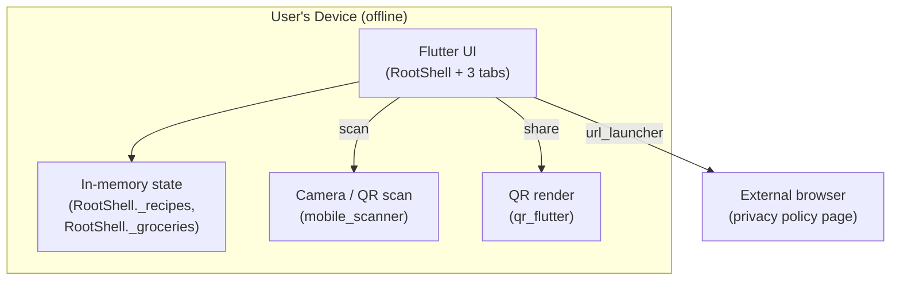

# My Food This Week — Project Documentation

_Generated from a full read of the repository. Updated after the nutrition/CIQUAL feature was fully removed from the codebase._

> This document describes the codebase **as it actually exists today**. Anything that could not be verified from the code is explicitly labeled `Unknown / Not determinable from the codebase`.

---

## 1. Executive Summary

**My Food This Week** (package name `eating_app`, app title set at runtime to "My Food This Week") is a **fully offline, local-only Flutter mobile app** for planning meals and generating grocery lists. Users create recipes with manually-entered nutrition totals (calories, protein, carbs, fat), browse a set of curated "community" recipes, generate a shopping list from selected recipes, and share recipes device-to-device via QR code — with **no backend, no accounts, and no network calls** except opening a static privacy-policy web page.

The app previously included an automatic nutrition-calculation engine that matched free-text ingredients against a bundled French CIQUAL food-composition database. **That entire feature has been removed** (see §20). Nutrition values are now entered manually per recipe, the same way the bundled community recipes have always worked.

The most significant remaining functional gap is that **user-created recipes and the grocery list are not persisted to disk** — they live only in in-memory widget state and are lost on app restart.

No Dolby-licensed code or references exist anywhere in the repository.

---

## 2. Product Overview

- **Platform**: Flutter (Android, iOS, plus generated Linux/macOS/Windows/web scaffolding — only Android/iOS appear actively targeted).
- **Purpose**: help a user assemble a personal recipe collection with manually-tracked nutrition, build a shopping list from selected recipes, and share recipes with other users via QR code.
- **Data source**: none at runtime. There is no bundled or external nutrition database; all nutrition numbers are either typed in by the user or hardcoded in the curated community-recipe list.
- **Audience**: individual/household users; no multi-user, team, or account concept exists.
- **Bundled content**: ~50 curated "community" recipes ship with the app for browsing/import, each with fixed nutrition values and a thumbnail image.

---

## 3. Feature Inventory

### 3.1 Recipe Management

**Purpose**: create, edit, browse, and delete personal recipes with user-entered nutrition totals.

**User story**: As a user, I can add a recipe with a name, meal type, portions, ingredients, and nutrition totals, so I can track what I plan to eat.

**How it works**: Recipes are created via a dialog on the Recipes tab. Ingredients are entered as plain name + quantity text pairs — there is no automatic food lookup or nutrition calculation. Calories/protein/carbs/fat totals for the recipe are entered directly by the user (mirroring how community recipes are defined).

**User flow**:
1. User opens the Recipes tab (`RecipesTab`).
2. User taps "add recipe" → dialog opens (`lib/features/recipes/presentation/screens/recipes_tab.dart`).
3. User enters name, meal type, portions, nutrition totals, and one or more ingredients (plain text fields for name + quantity).
4. User optionally attaches a photo via `image_picker`.
5. On save, the recipe is appended to `RootShell._recipes` (in-memory list).
6. User can view recipe details, edit, or delete a recipe.

**UI**: `RecipesTab` (search bar, filter panel via `RecipeFilterPanel`, recipe cards with `StatChip`s for calories/protein/portions, `RecipePhoto` thumbnail, `EmptyState` when no recipes match). Add/edit dialog with plain ingredient rows and numeric nutrition fields.

**Backend**: All logic runs in-process in Dart — no server. Key files: `lib/features/recipes/presentation/screens/recipes_tab.dart`, `lib/features/recipes/domain/entities/recipe.dart`, `lib/features/recipes/domain/entities/ingredient.dart`.

**API**: None.

**Database**: None. Recipes are not written to any database or file — see §16 Known Limitations.

**Dependencies**: `image_picker`.

**Permissions & Security**: No auth/accounts. Photo access requires OS camera/photo-library permission (declared in `docs/privacy-policy.md`).

**Edge cases**: empty/blank ingredient rows, missing nutrition values default to unset rather than a computed guess (no calculation happens at all now).

**Tests**: none identified specific to recipe CRUD beyond the general widget smoke test.

**Known limitations**: Recipes are lost on app restart (no persistence layer). `recipes_tab.dart` remains a large file mixing UI, state, and dialog logic.

---

### 3.2 Grocery List Generation

**Purpose**: turn a set of selected recipes into a deduplicated, quantity-combined shopping list.

**User story**: As a user, I can select recipes and generate a grocery list so I know what to buy, with matching ingredients across recipes automatically combined.

**How it works**: `RootShell._addToGroceries`/`_generateGroceries` (`lib/app/root_shell.dart`) iterate the chosen recipes' ingredients, dedupe by lowercased name, and combine raw quantity strings via `combineQuantities()` (`lib/features/groceries/domain/usecases/combine_quantities.dart`) — a regex-based summation (`^([\d.]+)\s*(.*)$`) that adds numeric amounts sharing the same unit string (e.g. "2 cups" + "1 cups" → "3 cups") and joins mismatched/non-numeric quantities with `" + "`. After generation the app switches to the Groceries tab.

**UI**: `GroceriesTab` (`lib/features/groceries/presentation/screens/groceries_tab.dart`) — `CheckboxListTile` per item with strike-through when checked, reset-all button behind a confirmation dialog, `EmptyState` when the list is empty.

**Database**: None — grocery items live only in `RootShell._groceries` (in-memory `List<GroceryItem>`), same persistence gap as recipes.

**Edge cases**: quantities with mismatched units are not merged numerically, just concatenated as text (e.g. "2 cups + 200 g").

**Known limitations**: not persisted; combination logic is a naive regex, not unit-aware.

**Tests**: none identified.

---

### 3.3 Community Recipes

**Purpose**: give users a ready-made, curated set of recipes to browse and optionally add to their own collection without having to author anything.

**User story**: As a user, I can browse ~50 pre-made recipes and add any of them to my personal list.

**How it works**: `communityBreakfastRecipes()` (`lib/features/recipes/domain/usecases/community_recipes.dart`) returns a hardcoded list of ~50 `Recipe` objects (despite the function name, it covers all meal types) with fixed per-portion nutrition values. Each recipe references a bundled JPG thumbnail under `assets/images/community_thumbnails/`.

**User flow**:
1. User opens the Community tab (`CommunityTab`).
2. Browses/searches/filters (reusing `RecipeFilterPanel` and `RecipeFilter`).
3. Taps a recipe to view details.
4. Taps "add to my recipes" → appends an independent copy (`recipe.copy()`) to the user's in-memory recipe list via `RootShell._addRecipe`.

**Database**: None — the list is a static in-code array.

**Known limitations**: community recipes are entirely static/hardcoded; adding new ones requires a code change and rebuild, not a data update. The previous authoring tool (`tool/community_dev/`) was removed along with the nutrition engine it depended on — new community recipes must now be added by hand-editing `community_recipes.dart`.

---

### 3.4 Recipe Filtering & Search

**Purpose**: let users narrow recipes (personal or community) by nutrient ranges and meal type.

**How it works**: `RecipeFilter` (`lib/features/recipes/domain/entities/recipe_filter.dart`) holds `NutrientRange` bounds for calories/protein/carbs/fat, plus a `mealTypes` set. `recipeMatchesFilter()` applies all criteria directly against each recipe's own totals (`recipe.calories`, `recipe.protein`, `recipe.carbs`, `recipe.fat`) — there is no per-ingredient summation anymore, since ingredients no longer carry nutrition data. Fiber range filtering was removed (no field left to filter on).

**UI**: `RecipeFilterPanel` (`lib/features/recipes/presentation/widgets/recipe_filter_panel.dart`) — shared between Recipes and Community tabs.

---

### 3.5 Recipe Sharing (QR Code)

**Purpose**: let a user share one or more recipes with another user of the app without any backend, by encoding them into a QR code.

**User story**: As a user, I can select recipes and generate a QR code so another user can scan it with their app and import those recipes.

**How it works**:
- **Encoding** (`RecipeShareCodec.encode`, `lib/features/sharing/domain/recipe_share_codec.dart`): `jsonEncode({'recipes': [...]})` → `gzip.encode` → `base64Url.encode` → a single text payload.
- **Display** (`ShareRecipesScreen`): renders the payload as a QR code (`qr_flutter`) and offers a "Share" button that opens the OS share sheet with the raw text payload via `share_plus`.
- **Scanning** (`ScanRecipesScreen`): uses `mobile_scanner`'s live camera view; `_onDetect()` decodes the scanned QR value via `RecipeShareCodec.decode` and pushes `ImportRecipesScreen`.
- **Import** (`ImportRecipesScreen`): checklist of decoded recipes (all pre-selected by default), user confirms selection, selected recipes are appended to the receiver's in-memory recipe list.

**Database**: None — pure in-memory encode/decode.

**Dependencies**: `qr_flutter`, `mobile_scanner`, `share_plus`.

**Permissions & Security**: Scanning requires camera permission. No encryption — the payload is gzip+base64, not encrypted. No sender-identity validation.

**Edge cases**: invalid/corrupt payload → `RecipeShareCodec.decode` throws `FormatException`. Recipe photo paths are nulled on import (`Recipe.fromJson`) since they can't resolve on the receiving device's filesystem.

**Tests**: none identified.

**Known limitations**: no dedicated test coverage for the sharing feature.

---

### 3.6 Localization (English / French)

**Purpose**: support English and French UI text.

**How it works**: Standard Flutter `gen-l10n` codegen (`l10n.yaml`, `flutter: generate: true` in `pubspec.yaml`) from `lib/l10n/app_en.arb` (canonical/template) and `lib/l10n/app_fr.arb`. English has more keys than French — some newer strings may lack French translations. Some ARB keys tied to the now-removed nutrition/matching UI may be unused; not cleaned up.

**Known limitations**: possible incomplete French coverage; possible small number of dead ARB keys left over from the nutrition feature removal.

---

## 4. User Roles & Permissions

There is **no authentication, account, or role system** in this application. The app has a single implicit "user" — the device owner. All data is local to the device; sharing is peer-to-peer via QR code, not account-based. This matches `docs/privacy-policy.md` ("does not require or support accounts").

---

## 5. Major User Flows

### 5.1 App Launch
1. `main()` (`lib/main.dart`) initializes Flutter bindings and calls `runApp(const MyApp())` directly — no database bootstrap, no provider setup.
2. `MyApp` builds a `MaterialApp` (Material 3 theme, `AppPalette` seed colors, Georgia font, EN/FR localization) with `home: RootShell()`.
3. `RootShell` renders a 3-tab `NavigationBar` (Recipes / Groceries / Community) over an `IndexedStack`.

### 5.2 Create a Recipe → Generate Grocery List
See §3.1 and §3.2 — manual recipe entry, then selecting recipes to merge ingredients into the Groceries tab.

### 5.3 Share Recipes Device-to-Device
See §3.5 — full sender/receiver QR flow.

### 5.4 Browse & Adopt a Community Recipe
See §3.3.

No registration, login, password-reset, payment, subscription, notification, email, or admin workflows exist in this codebase.

---

## 6. Application Architecture



- **Frontend architecture**: single Flutter app, feature-folder layout (`lib/features/{recipes,groceries,sharing}`).
- **State management**: plain `StatefulWidget`/`setState` throughout. Riverpod was removed along with the nutrition feature — no state-management package dependency remains.
- **Backend**: none. No server, no API, no cloud database.
- **Database**: none. There is no local database of any kind in the current codebase.
- **Caching**: none.
- **Background jobs / queues / scheduled tasks**: none.
- **Logging / monitoring**: none (no analytics, no crash reporting SDKs in `pubspec.yaml`).
- **Error handling**: exceptions surface as thrown Dart exceptions (e.g. `FormatException` in the share codec); no centralized error-reporting mechanism.

---

## 7. Repository Structure

```text
lib/
├── app/root_shell.dart        # Top-level 3-tab shell, in-memory recipes/groceries state
├── core/
│   ├── theme/                  # AppPalette color scheme
│   └── widgets/                # EmptyState, StatChip (shared UI)
├── features/
│   ├── groceries/               # Grocery list domain + Groceries tab UI
│   ├── recipes/                  # Recipe entities, community recipes, Recipes/Community tabs
│   └── sharing/                  # QR encode/decode + share/scan/import screens
├── l10n/                        # ARB source + generated AppLocalizations
└── main.dart                    # Entry point

assets/images/community_thumbnails/ # ~50 recipe thumbnails for community recipes
test/widget_test.dart              # Only remaining test — smoke test for the 3 nav tabs
docs/privacy-policy.md             # Published privacy policy
android/, ios/, linux/, macos/, windows/, web/  # Platform scaffolding (generated)
flutter_build/                     # STALE duplicate/default Flutter scaffold — not the real app, ignore
```

Everything under `flutter_build/` is a leftover default Flutter counter-app template — not part of the shipped application.

**Removed in the nutrition-feature cleanup** (previously documented, no longer present): `lib/features/nutrition/`, `lib/core/database/`, `lib/core/units/`, `lib/core/text/`, `assets/db/nutrition.db`, `food_bd/`, `tool/community_dev/`, and all nutrition-engine test files.

---

## 8. Frontend Architecture

- **Entry**: `lib/main.dart` → `MyApp` → `RootShell` (`lib/app/root_shell.dart`).
- **Navigation**: no router package; a single `IndexedStack` switched by a `NavigationBar`, tab index held in `RootShell._tabIndex` (`setState`). Sub-screens (share/scan/import) are pushed via standard `Navigator.push`.
- **Theming**: `AppPalette` (`lib/core/theme/app_palette.dart`) defines a pastel Material 3 seed palette; Georgia font family throughout.
- **Reusable widgets**: `EmptyState`, `StatChip` (`lib/core/widgets/`); feature-specific widgets like `RecipePhoto`, `RecipeFilterPanel`.
- **Forms/dialogs**: recipe add/edit is an in-place dialog inside `RecipesTab`, not a separate route.

---

## 9. Backend Architecture

There is no backend server and no local database. All logic is Dart code executed on-device, primarily in `lib/features/recipes/domain/`, `lib/features/groceries/domain/`, and `lib/features/sharing/domain/`. No background processing, isolates, workers, or job queues exist.

---

## 10. Database & Data Model

**There is no database in the current codebase.** The previous sqflite-based CIQUAL nutrition database was fully removed.

### In-app-memory "models" (not persisted anywhere)
- `Recipe` (`lib/features/recipes/domain/entities/recipe.dart`): name, calories/protein/portions (int), ingredients, description, mealType, photoPath?, carbs?/fat? (int?), checkedIngredients. Has `toJson()`/`fromJson()` used by the sharing codec, and `copy()` used when adopting a community recipe. `fromJson` deliberately nulls `photoPath` since a shared recipe's photo path points to the sender's filesystem.
- `Ingredient` (`lib/features/recipes/domain/entities/ingredient.dart`): simplified to `{name, quantity}` — no longer carries nutrition or match-confidence fields.
- `GroceryItem` (`lib/features/groceries/domain/entities/grocery_item.dart`): name, rawQuantities (list of strings), checked, computed `displayQuantity`.

No ER diagram is applicable — there are no persisted tables or foreign-key relationships.

---

## 11. API Reference

**There is no HTTP/REST API in this project.** The application makes exactly one outbound network-adjacent call: opening a static privacy-policy webpage in the device's external browser via `url_launcher` (`lib/features/recipes/presentation/screens/recipes_tab.dart`). No authentication required.

---

## 12. Authentication & Authorization

**Not implemented.** No login, registration, session, token, or password-handling code exists anywhere in `lib/`. There are no user roles or resource-ownership rules.

---

## 13. External Integrations

| Service | Purpose | Where used | Required? |
|---|---|---|---|
| None (backend) | — | — | — |
| Device camera | QR scanning to import shared recipes | `mobile_scanner` in `ScanRecipesScreen` | Optional |
| Device camera/photo library | Attach a recipe photo | `image_picker` in `RecipesTab` | Optional |
| OS share sheet | Send the share payload via any installed app | `share_plus` in `ShareRecipesScreen` | Optional |
| External browser | View privacy policy | `url_launcher` opening a static webpage | Optional |

No Firebase, Supabase, analytics, crash reporting, payment, or any cloud service is present.

---

## 14. Configuration & Environment Variables

No `.env` file, no environment-variable usage, and no secrets/API keys exist anywhere in the repository. The only configuration is `l10n.yaml` (localization codegen) and `pubspec.yaml`'s `assets:` section (community thumbnails only, now that `assets/db/nutrition.db` has been removed).

---

## 15. Business Logic & Rules

- **Recipe nutrition is entered manually** — there is no calculation, validation, or plausibility checking of nutrition values anymore.
- **Recipe filter ranges** are evaluated directly against each recipe's own `calories`/`protein`/`carbs`/`fat` fields — no aggregation logic remains.
- **Shared recipe photo nulling**: `Recipe.fromJson` always discards `photoPath` on decode, because a received photo path is meaningless on the receiving device's filesystem.
- **Grocery quantity combination**: only combines quantities that share an identical trailing unit string; otherwise concatenates with " + ".

---

## 16. Error Handling

- **Sharing codec**: `RecipeShareCodec.decode` throws `FormatException` on invalid/corrupt payloads.
- **No centralized logging, crash reporting, or retry/fallback mechanism** exists anywhere in the codebase.

---

## 17. Testing

- **Framework**: `flutter_test`.
- **Current state**: only `test/widget_test.dart` remains — a smoke test that pumps `MyApp` and asserts the 3 nav tab labels render. All other tests (which previously covered the nutrition-matching engine extensively) were removed along with that feature.
- **Untested areas**: recipe CRUD, groceries, sharing/QR encode-decode — no dedicated test coverage exists for any of these.
- **How tests are run**: `flutter test`. No CI configuration file was found — `Unknown / Not determinable from the codebase` whether tests run automatically on push.

---

## 18. Development Setup

**Prerequisites**: Flutter SDK compatible with Dart `^3.12.2`, Android/iOS toolchains for device builds.

```
flutter pub get
flutter gen-l10n
flutter run
flutter test
```

No database setup or seeding is required — the app has no persistence layer.

---

## 19. Deployment & Infrastructure

- **Build process**: standard Flutter build commands (`flutter build apk`/`appbundle`/`ipa`).
- **CI/CD**: no CI configuration file found.
- **Hosting**: none required (offline app); the privacy policy is a static page hosted outside this repository.
- **Monitoring**: none.

---

## 20. Technical Decisions

| Decision | Where | Rationale | Trade-off |
|---|---|---|---|
| Removed the CIQUAL nutrition-matching engine entirely | app-wide | Explicit product decision (confirmed by the user); the feature added significant complexity (matching, unit conversion, a bundled database, Riverpod) for automatic nutrition lookup | Recipes now require manually entering nutrition totals, same as community recipes always did; no more ingredient-level nutrition insight |
| Plain `StatefulWidget`/`setState` everywhere | app-wide | Simplicity, no remaining need for Riverpod once the DB layer was removed | No structured app-wide state management if the app grows more complex |
| No persistence for user recipes/groceries | `RootShell` | Reason not determinable from the codebase — appears to be an in-progress app | Data loss on every app restart — the most consequential open gap |
| QR + gzip/base64 sharing instead of a backend | `lib/features/sharing/` | Keeps the app fully offline/privacy-preserving | Payload size limited by QR code capacity; no delivery confirmation |

---

## 21. Project Status

### Fully Implemented
- Recipe creation/editing UI and community recipe browsing (§3.1, §3.3).
- Grocery list generation logic (§3.2) — functional but not persisted.
- QR-based recipe sharing (§3.5).
- English/French localization scaffolding, though full FR translation completeness is unverified.
- Recipe filtering by meal type and manually-entered nutrient ranges (§3.4).

### Partially Implemented
- **Recipe & grocery persistence**: entities and UI are complete, but nothing is written to disk — data is lost on restart.
- **French localization**: fewer ARB keys than English.

### Planned / TODO
- Privacy-policy URL awaiting the real GitHub Pages repo.
- Community recipes now require manual code edits to add new entries, since the authoring tool was removed with the nutrition engine.

### Deprecated / Removed
- The entire CIQUAL/nutrition-calculation feature, its database, its dependencies, and its tests were removed from the codebase (see §20).
- `flutter_build/` directory is stale scaffold cruft, unrelated to this removal.

### Unclear
- Exact error-handling behavior in the sharing screens when a scanned QR payload is invalid.
- Whether any ARB localization keys are now unused after the nutrition feature removal (not audited key-by-key).

---

## 22. Technical Debt & Risks

**Confirmed issues**:
- User recipes and grocery lists have no persistence layer at all (`RootShell` in-memory `State` fields only).
- `recipes_tab.dart` remains a large file mixing UI, state, and dialog orchestration.
- No test coverage for recipe CRUD, groceries, or sharing — the test suite currently consists of a single smoke test.
- No incremental way to add community recipes short of editing code directly, now that the authoring tool is gone.
- Hardcoded external URL with an open TODO, pointing to a GitHub Pages site that may not yet exist.

**Potential issues**:
- In-memory-only storage will surprise users who expect their data to survive an app kill — the single highest-impact product gap.
- Sharing payload isn't encrypted or authenticated — acceptable for recipe data, but worth noting.
- Grocery quantity merging is purely string/regex based and will silently fail to merge equivalent quantities expressed in different units.

**Recommendations**:
- Add a persistence layer (e.g. `shared_preferences`, Hive, or a lightweight local DB) so user data survives restarts.
- Add tests for recipe CRUD, groceries, and sharing given the test suite is now minimal.

---

## 23. Feature-to-Code Mapping

| Feature | Frontend | Backend/Domain | Database | Tests |
|---|---|---|---|---|
| Recipe CRUD | `lib/features/recipes/presentation/screens/recipes_tab.dart` | `lib/features/recipes/domain/entities/recipe.dart`, `ingredient.dart` | none (in-memory) | none identified |
| Groceries | `lib/features/groceries/presentation/screens/groceries_tab.dart` | `lib/features/groceries/domain/usecases/combine_quantities.dart`, `lib/app/root_shell.dart` | none (in-memory) | none identified |
| Community recipes | `lib/features/recipes/presentation/screens/community_tab.dart` | `lib/features/recipes/domain/usecases/community_recipes.dart` | none (hardcoded) | none identified |
| Sharing (QR) | `lib/features/sharing/presentation/screens/*` | `lib/features/sharing/domain/recipe_share_codec.dart` | none | none identified |
| Filtering | `lib/features/recipes/presentation/widgets/recipe_filter_panel.dart` | `lib/features/recipes/domain/entities/recipe_filter.dart` | n/a | none identified |
| Localization | `lib/l10n/*` | n/a | n/a | none identified |
| App shell/nav | `lib/app/root_shell.dart` | n/a | n/a | `test/widget_test.dart` |

---

## 24. Glossary

- **Recipe**: a user-created or community-provided dish entry with name, meal type, portions, manually-entered nutrition totals, and ingredients.
- **Ingredient**: a line item within a `Recipe` — plain free-text name + quantity, no automatic nutrition data.
- **Community recipe**: one of the ~50 hardcoded curated recipes bundled with the app, distinct from user-created recipes.
- **RootShell**: the top-level widget holding the 3-tab navigation and the (non-persisted) in-memory recipe/grocery state.
- **Share payload**: the gzip+base64-encoded JSON blob produced by `RecipeShareCodec`, embedded in a QR code or shared as text.

---

*End of document. This documentation reflects the repository after the nutrition/CIQUAL feature was fully removed. The most consequential remaining gap is the lack of persistence for user recipes and groceries.*
