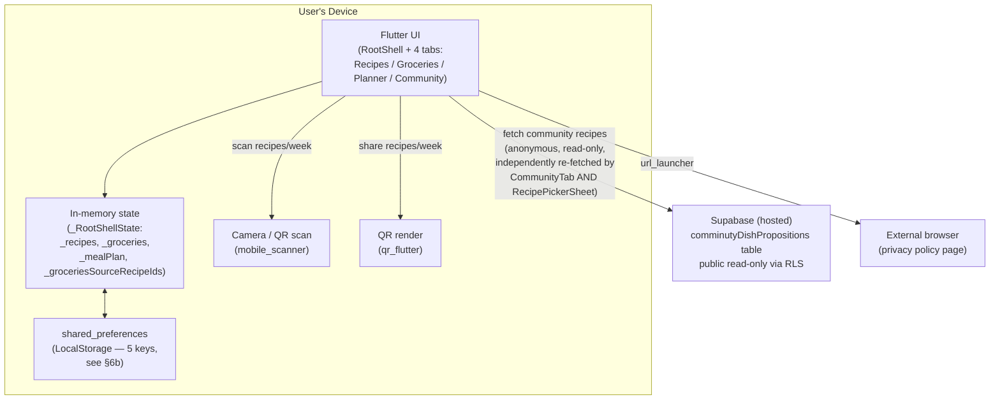

# My Food This Week — Project Documentation

_Generated from a full read of the repository, followed by a 7-area multi-agent code review (each area independently re-verified against the actual source) covering every feature folder plus cross-cutting performance, architecture, testing, and security concerns. Updated 2026-09-06 to correct persistence-related inaccuracies in the previous revision and to document the Weekly Planner feature, which existed in code but was entirely missing from this document._

> This document describes the codebase **as it actually exists today**. Every claim below was verified by directly reading the referenced file/line, not inferred. Anything that could not be verified is explicitly labeled `Unknown / Not determinable from the codebase`.

---

## 1. Executive Summary

**My Food This Week** (package name `eating_app`, app title set at runtime to "My Food This Week") is a **local-first Flutter mobile app** for planning meals, generating grocery lists, and planning a week of meals ahead. Users create recipes with manually-entered nutrition totals (calories, protein, carbs, fat), browse a set of curated "community" recipes fetched from Supabase, assign recipes to a 7-day/4-slot weekly planner, generate a shopping list from selected recipes or a planned week, and share recipes and whole weekly plans device-to-device via QR code.

**Correction to prior documentation**: earlier revisions of this document claimed user recipes and the grocery list "are not persisted to disk" and are "lost on app restart." **This is no longer true and, per the app's own git history, has not been true for some time.** `lib/app/local_storage.dart` is a complete `shared_preferences`-backed persistence layer that saves and reloads the user's recipes, groceries, weekly meal-plan entries, the grocery list's "source recipes" tracking, and an offline cache of the last successfully fetched community recipes. See §6b for the full picture, including real remaining gaps in that layer (no schema versioning, no error handling around corrupted stored data, un-debounced full-list rewrites).

The app makes **one backend call category**: community recipes are fetched anonymously and read-only from a hosted **Supabase** Postgres table instead of being hardcoded in Dart (see §6a). There is still **no backend for user-created recipes or the weekly plan, no accounts, and no login** — the app has no user identity of any kind. Aside from the community-recipe fetch and opening a static privacy-policy web page, there are no other network calls.

The most significant *newly confirmed* gaps, found by direct code reading rather than assumption, are a set of **real correctness bugs** in the grocery-quantity-combination logic (a third-or-later distinct unit is never merged with earlier occurrences of that unit, and fraction-shaped quantities like `"1/2 cup"` are silently corrupted into a nonsensical unit) and in the Weekly Planner + recipe-sharing QR flows (both scan screens silently swallow decode failures with zero user feedback, and both QR-render screens can silently show a blank box for an oversized payload). None of these are hypothetical — each was traced by hand against the actual regex/parsing code. See §25 for the full, prioritized list of what to fix and why.

**Security note**: the previously-documented issue of a real Supabase key being hardcoded and committed in `.vscode/launch.json` **has been fixed**. The tracked file now reads `--dart-define=SUPABASE_ANON_KEY=${env:SUPABASE_ANON_KEY}` from the host environment; no literal key value exists in the file today. See §14.

No Dolby-licensed code or references exist anywhere in the repository (re-confirmed by a repository-wide, case-insensitive search during this review; the only two hits are this document and `PROJECT_OVERVIEW.md` themselves, stating that no such references exist).

---

## 2. Product Overview

- **Platform**: Flutter (Android, iOS, plus generated Linux/macOS/Windows/web scaffolding — only Android/iOS appear actively targeted).
- **Purpose**: help a user assemble a personal recipe collection with manually-tracked nutrition, plan which recipes to eat on which day of the week, build a shopping list from selected recipes or a planned week, and share recipes and weekly plans with other users via QR code.
- **Data source**: no nutrition-calculation database of any kind. Nutrition numbers are either typed in by the user or come from the community-recipe rows fetched from Supabase.
- **Audience**: individual/household users; no multi-user, team, or account concept exists.
- **Bundled/remote content**: ~50 curated "community" recipes, served from a Supabase table (`comminutyDishPropositions`), each with fixed nutrition values and a thumbnail image (local asset paths currently; a migration to Supabase Storage URLs appears intended but not yet wired into the UI — see §6a).
- **Persistence**: recipes, groceries, the weekly meal plan, grocery-list source-recipe tracking, and a community-recipe offline cache are all saved on-device via `shared_preferences` (see §6b). This is a correction to earlier documentation, which incorrectly described the app as fully non-persistent.

---

## 3. Feature Inventory

### 3.1 Recipe Management

**Purpose**: create, edit, browse, and delete personal recipes with user-entered nutrition totals.

**User story**: As a user, I can add a recipe with a name, meal type, portions, ingredients, and nutrition totals, so I can track what I plan to eat.

**How it works**: Recipes are created via a dialog on the Recipes tab. Ingredients are entered as plain name + quantity text pairs — there is no automatic food lookup or nutrition calculation. Calories/protein/carbs/fat totals for the recipe are entered directly by the user (mirroring how community recipes are defined).

**User flow**:
1. User opens the Recipes tab (`RecipesTab`).
2. User taps "add recipe" → a large inline `AlertDialog` opens (`_openAddRecipeDialog`, `lib/features/recipes/presentation/screens/recipes_tab.dart:207-468`, ~261 lines).
3. User enters name, meal type, portions, nutrition totals, and one or more ingredients (plain text fields for name + quantity).
4. User optionally attaches a photo via `image_picker`.
5. On save, `RootShell._addRecipe` (`root_shell.dart:55-60`) appends the recipe to `_recipes` inside `setState`, then fires `LocalStorage.saveRecipes(_recipes)` **unawaited, with no error handling** — see §25.1.
6. User can view recipe details (a second inline dialog, `_openRecipeDetailsDialog`, lines 470-573), edit, or delete a recipe.

**UI**: `RecipesTab` (search bar, filter panel via `RecipeFilterPanel`, recipe cards with `StatChip`s for calories/protein/portions, `RecipePhoto` thumbnail, `EmptyState` when no recipes match). Add/edit dialog with plain ingredient rows and numeric nutrition fields.

**Backend**: All logic runs in-process in Dart — no server for personal recipes. Key files: `lib/features/recipes/presentation/screens/recipes_tab.dart`, `lib/features/recipes/domain/entities/recipe.dart`, `lib/features/recipes/domain/entities/ingredient.dart`.

**API**: None.

**Database**: None remotely. Locally, recipes round-trip through `shared_preferences` via `LocalStorage.saveRecipes`/`loadRecipes`, using `Recipe.toJson()`/`Recipe.fromLocalJson()` (the local-storage-specific factory that preserves `photoPath`, as opposed to `Recipe.fromJson()`, which is used only by the QR-sharing codec and deliberately nulls `photoPath`). See §6b, §10.

**Dependencies**: `image_picker`.

**Permissions & Security**: No auth/accounts. Photo access requires OS camera/photo-library permission (declared in `docs/privacy-policy.md`).

**Known limitations** (verified):
- `recipes_tab.dart` is **868 lines**, mixing UI, `setState`-based state, and two full inline dialogs (add/edit and details) that are not standalone, independently testable widgets — see §25.3.
- The details dialog and its ingredient-checklist rendering are duplicated near-verbatim in `CommunityTab` (`community_tab.dart:105-189`) — see §25.3.
- **Ingredient-checkbox toggle doesn't reliably persist**: toggling a checkbox in the expanded card (`recipes_tab.dart:791-802`) or the details dialog (`recipes_tab.dart:535-549`) mutates `recipe.checkedIngredients[i]` via plain `setState`, but never calls `onUpdateRecipe`. Because `RootShell` only calls `_storage.saveRecipes(_recipes)` from `_addRecipe`/`_updateRecipe`/`_deleteRecipe`, a checked-ingredient change reaches disk only if some unrelated recipe edit happens to run afterward — otherwise it's silently lost on restart. See §25.1.
- Recipe filtering has a correctness edge case: an active carbs/fat filter treats a recipe's `null` (i.e. "unknown") carbs/fat as if it were exactly `0`, incorrectly excluding "nutrition unknown" recipes under any non-zero minimum filter (`recipe_filter.dart:94,97`). See §25.1.
- No dedicated unit tests exist for `recipeMatchesFilter` or `Recipe`'s three JSON factories (`fromJson`/`fromLocalJson`/`fromSupabaseRow`).

---

### 3.2 Grocery List Generation

**Purpose**: turn a set of selected recipes, or a planned week, into a deduplicated, quantity-combined shopping list.

**User story**: As a user, I can select recipes (or generate from my weekly plan) and get a grocery list so I know what to buy, with matching ingredients across recipes automatically combined.

**How it works**: there are three separate entry points, all routed through the same shared merge logic in `RootShell` (`lib/app/root_shell.dart`):
1. `GroceriesTab`'s own "+" FAB → `_addGroceryItem`.
2. `RecipesTab`'s "Add to groceries" / "Generate groceries" buttons → `_addToGroceries` / `_generateGroceries` (the latter fully clears and replaces the existing grocery list, **losing any existing checked state** — a real behavioral difference from "add to groceries" that isn't otherwise called out in the UI).
3. `PlannerTab`'s "Generate groceries" action (see §3.6) → `_generateGroceriesFromMealPlan`, which for each planned entry computes a scale factor (`entry.servings / recipe.portions`) and runs each ingredient's quantity through `scaleQuantity()` before merging.

All three funnel into `_mergeIntoGroceries` (`root_shell.dart:103-140`), which keys existing and incoming items by trimmed-lowercased ingredient name, preserves first-seen order, and combines raw quantity strings via `combineQuantities()` (`lib/features/groceries/domain/usecases/combine_quantities.dart`).

**Verified correctness bugs in the combination logic** (see §25.1 for fixes):
- **Only one unit ever accumulates.** `combineQuantities` keeps a single `(amount, unit)` accumulator seeded by whichever quantity is parsed first; any later quantity with a *different* unit is appended to `extras` as literal text — even if that same non-primary unit recurs. Traced by hand: `combineQuantities(['2 cups', '3 tbsp', '1 tbsp'])` → `'2 cups + 3 tbsp + 1 tbsp'` instead of the correct `'2 cups + 4 tbsp'`.
- **Fractional quantities are silently corrupted.** The parsing regex `^([\d.]+)\s*(.*)$` only captures leading digits/dots as the amount, so for `'1/2 cup'` it captures amount `1` and unit `'/2 cup'`. Traced by hand: `combineQuantities(['1/2 cup', '1/2 cup'])` → `'2 /2 cup'`, a nonsensical result. The identical regex is reused in `scale_quantity.dart`, so scaling a planner ingredient's `'1/2 cup'` by 2 produces the same `'2 /2 cup'` corruption.
- **No unit normalization.** `'2 cup'` and `'1 cups'` are compared with plain string equality after trim/lowercase, so plural/singular variants never combine (`'2 cup + 1 cups'` instead of `'3 cups'`).

**UI**: `GroceriesTab` (`lib/features/groceries/presentation/screens/groceries_tab.dart`) — `CheckboxListTile` per item with strike-through when checked, reset-all button behind a confirmation dialog, `EmptyState` when the list is empty, and a `GroceriesSourceRecipesScreen` showing which recipes contributed to the current list (via `_groceriesSourceRecipeIds`, silently dropping ids whose recipe was since deleted).

**Database**: None remotely. Locally, `LocalStorage.saveGroceries`/`loadGroceries` persist the list via `shared_preferences` (`GroceryItem.toJson`/`fromJson`), alongside `saveGroceriesSourceRecipeIds`. See §6b.

**Known limitations** (verified):
- The three correctness bugs above are real and reproducible — this is the single highest-value area to fix in the whole app (see §25.1).
- `GroceryItem.displayQuantity` re-runs `combineQuantities` from scratch on every read with no memoization; toggling one checkbox does an empty `setState((){})` that rebuilds the whole `GroceriesTab`, re-parsing every item's raw quantities through the regex again.
- `_mergeIntoGroceries`/`_generateGroceries` live directly in `_RootShellState` rather than as testable domain usecases (unlike `combine_quantities.dart`/`scale_quantity.dart`, which are properly isolated and unit-tested), and both hardcode `_tabIndex = 2` mid-operation, coupling the merge algorithm to the widget lifecycle.
- Test coverage (`test/features/groceries/combine_quantities_test.dart`) only exercises 2-element lists and never a 3-distinct-unit or fractional-quantity case — the exact cases that reveal the bugs above. There is no test file at all for `scale_quantity.dart`.

---

### 3.3 Community Recipes

**Purpose**: give users a ready-made, curated set of recipes to browse and optionally add to their own collection without having to author anything.

**User story**: As a user, I can browse ~50 pre-made recipes and add any of them to my personal list.

**How it works**: `fetchCommunityRecipes()` (`lib/features/recipes/data/community_recipes_remote_data_source.dart`) queries the Supabase table `comminutyDishPropositions` anonymously (`supabase.from('comminutyDishPropositions').select()`, unbounded — no `.limit()`/`.range()`) and maps each row to a `Recipe` via `Recipe.fromSupabaseRow()`. `CommunityTab` calls this in `initState`.

**Correction to prior documentation — offline fallback exists and works**: earlier documentation stated the Community tab has "no offline fallback" and shows only a raw error message on failure. **This is incorrect.** `CommunityTab._loadRecipes` (`community_tab.dart:51-77`) does the following, verified directly:
1. On success, it fires-and-forgets `LocalStorage.cacheCommunityRecipes()` to save the batch as an offline fallback.
2. On any exception, it swallows the error, loads the last cached batch via `LocalStorage.loadCachedCommunityRecipes()`, and shows a `MaterialBanner` ("showing cached data") if a cache exists, or a full `EmptyState` with a retry button if there is no cache at all.

This is a genuinely good pattern in the codebase and, notably, the *only* place a QR-scan-style failure gets user-visible, localized feedback — contrast with §3.5 and §3.6's scan screens, which fail silently.

**User flow**:
1. User opens the Community tab (`CommunityTab`) → recipes are fetched live from Supabase (or served from cache on failure).
2. Browses/searches/filters (reusing `RecipeFilterPanel` and `RecipeFilter`).
3. Taps a recipe to view details.
4. Taps "add to my recipes" → appends an independent copy (`recipe.copy()`, fresh id) to the user's list via `RootShell._addRecipe`.

**Database**: Supabase Postgres table `comminutyDishPropositions`, public read-only via RLS (see §6a, §10a). Locally cached via `shared_preferences` (see §6b).

**Known limitations** (verified):
- **`RecipePickerSheet` (the planner's recipe picker, §3.6) independently re-fetches community recipes from scratch**, with no shared cache and no retry affordance — a real duplication of both the fetch and the offline-fallback logic that `CommunityTab` already has. See §25.3.
- The fetch has no pagination — the entire table loads into memory on every mount and every manual retry.
- Table-name inconsistency in the surrounding code and tooling: the app and `supabase/schema.sql` agree on `comminutyDishPropositions`, but `Recipe.fromSupabaseRow`'s doc comment (`recipe.dart:109`), `CommunityTab`'s class doc (`community_tab.dart:15-16`), and `supabase/seed/push_community_recipes.py` all reference a differently-spelled `community_recipies` — a documentation/comment drift that doesn't affect runtime behavior but will mislead anyone grepping the schema.
- **A single malformed community row fails the entire fetch.** `fetchCommunityRecipes()` maps rows via `.map(Recipe.fromSupabaseRow).toList()` with no per-row error handling; `fromSupabaseRow` does hard, non-nullable casts, so one bad row throws and discards the whole freshly-fetched batch (falling back to stale cache or empty state) rather than just skipping that row. See §25.1.

---

### 3.4 Recipe Filtering & Search

**Purpose**: let users narrow recipes (personal, community, or in the planner's recipe picker) by nutrient ranges and meal type.

**How it works**: `RecipeFilter` (`lib/features/recipes/domain/entities/recipe_filter.dart`) holds `NutrientRange` bounds for calories/protein/carbs/fat, plus a `mealTypes` set and include/exclude ingredient-name substring sets. `recipeMatchesFilter()` applies all criteria directly against each recipe's own totals.

**UI**: `RecipeFilterPanel` (`lib/features/recipes/presentation/widgets/recipe_filter_panel.dart`) — reused, independently, by **three** screens: `RecipesTab`, `CommunityTab`, and (as of the current in-progress change) `RecipePickerSheet` in the Weekly Planner. All three also independently duplicate an identical `_activeFilterCount()` helper and the entire search-box-plus-filter-chip header row — see §25.3 for the recommended consolidation.

**Known limitations** (verified): the null-carbs/fat-treated-as-zero bug described in §3.1; no unit tests for the filter predicate.

---

### 3.5 Recipe Sharing (QR Code)

**Purpose**: let a user share one or more recipes with another user of the app without any backend, by encoding them into a QR code.

**User story**: As a user, I can select recipes and generate a QR code so another user can scan it with their app and import those recipes.

**How it works**:
- **Encoding** (`RecipeShareCodec.encode`, `lib/features/sharing/domain/recipe_share_codec.dart`): `jsonEncode({'recipes': [...]})` → `gzip.encode` → `base64Url.encode` → a single text payload. This runs synchronously inside `ShareRecipesScreen.build()` with no memoization, so it re-runs on every rebuild (e.g. rotation) and can cause a visible frame drop for a large selection.
- **Display** (`ShareRecipesScreen`): renders the payload as a QR code (`qr_flutter`, `version: QrVersions.auto`, fixed 260px) and offers a "Share" button via `share_plus`. **There is no capacity check.** If the payload exceeds what any QR version can hold, `qr_flutter`'s internal validator fails and — since no `errorStateBuilder` is supplied — the widget silently renders an empty `Container()`: the user sees a blank box with zero explanation, not a crash or error message.
- **Scanning** (`ScanRecipesScreen`): uses `mobile_scanner`'s live camera view (constructed with no `formats` restriction, so it scans every barcode format the platform supports, not just QR — pure overhead for this use case). `_onDetect()` decodes the scanned value via `RecipeShareCodec.decode` inside `try { ... } catch (_) { return; }` — **any decode failure is silently swallowed with no SnackBar or other feedback**; the camera preview just keeps running, which reads to the user as a broken scanner rather than a rejected code. The camera itself is also never explicitly stopped after a successful scan, so it keeps running underneath the pushed `ImportRecipesScreen`.
- **Import** (`ImportRecipesScreen`): checklist of decoded recipes (all pre-selected by default), user confirms selection, selected recipes are appended to the receiver's recipe list (and persisted through the normal `onAddRecipe` → `LocalStorage.saveRecipes` path).

**Database**: None — pure in-memory encode/decode, then normal recipe persistence on import.

**Dependencies**: `qr_flutter`, `mobile_scanner`, `share_plus`.

**Permissions & Security**: Scanning requires camera permission. No encryption — the payload is gzip+base64, not encrypted. No sender-identity validation.

**Known limitations** (verified): `decode()`'s doc comment promises a `FormatException` on any invalid payload, but a payload missing the `recipes` key throws a `TypeError` from an unchecked cast instead — the actual contract is broader than documented. No dedicated test exists for `ScanRecipesScreen`'s detect-handling branches (only the codec's encode/decode round-trip is tested).

---

### 3.6 Weekly Meal Planner

_This feature exists fully in the codebase today but was entirely undocumented in prior revisions of this document._

**Purpose**: let a user assign recipes to specific days and meal slots across a week, see daily nutrition totals, generate a grocery list from the planned week, and share/import a whole week via QR code.

**User story**: As a user, I can lay out breakfast/lunch/dinner/snack for each day of a week using my own or community recipes, see the day's total macros, and either turn the week into a grocery list or share it with someone else.

**How it works**: `PlannerTab` (`lib/features/planner/presentation/screens/planner_tab.dart`, 361 lines) renders a left-hand day-of-week sidebar (`PlannerDaySidebar`) plus week navigation (previous/next week via `_shiftWeek`), a row of `StatChip`s showing the selected day's total calories/protein/carbs/fat (`_totalsForDate`, which sums each entry's recipe totals scaled by `entry.servings / recipe.portions`), and a scrollable list of four meal-slot sections (`MealSlotSection` → `AssignedMealCard` per assigned recipe) for **breakfast, lunch, dinner, and snack** — `MealType` also defines a fifth value, `drink`, which the planner never exposes as a slot.

- **Adding/replacing a meal**: `_openRecipePickerFlow` pushes `RecipePickerSheet` (`lib/features/planner/presentation/widgets/recipe_picker_sheet.dart`, 211 lines), seeded with the target slot's meal type. This sheet has its own "My recipes" section (filtered/searched locally) plus a lazily-fetched, independently-cached-nowhere "Community" section (it re-calls `fetchCommunityRecipes()` itself rather than sharing `CommunityTab`'s fetch/cache — see §3.3, §25.3). As of the most recent change to this file, the sheet also has its own search box and its own `RecipeFilterPanel` instance, seeded to the slot's meal type — a third independent implementation of the search+filter UI already present in `RecipesTab` and `CommunityTab`. Picking a recipe (adding it to the user's own list first via `onAddRecipe` if it came from Community) then prompts for a servings count via a small dialog before creating the `MealPlanEntry`.
- **Adjusting servings**: `_adjustServings` removes the existing entry and re-adds it with the same `id` and a new `servings` value — an update-by-remove-then-readd rather than an in-place mutation.
- **Generating groceries from the week**: the app-bar cart icon → confirmation dialog → `onGenerateGroceries(weekEntries)` → `RootShell._generateGroceriesFromMealPlan`, which scales each entry's ingredient quantities via `scaleQuantity()` (subject to the same fraction-parsing bug described in §3.2) before merging into the grocery list.
- **Sharing a week**: the app-bar share icon → `ShareMealPlanScreen`, which encodes the visible week's `MealPlanEntry` list *plus the full `Recipe` objects they reference* (name, description, ingredients, nutrition — not just an id) via `MealPlanShareCodec.encode()` (JSON → gzip → base64url, mirroring `RecipeShareCodec`) into a QR code and share-sheet text. Because full recipe objects are embedded, a week touching several recipes with long descriptions/ingredient lists can push the payload past QR capacity — the same silent-blank-box failure mode as §3.5 applies here too (`share_meal_plan_screen.dart`, no `errorStateBuilder`).
- **Scanning/importing a week**: the app-bar scan icon → `ScanMealPlanScreen`, whose `_onDetect` wraps `MealPlanShareCodec.decode()` in the same `catch (_) { return; }` pattern as the recipe-sharing scanner, and additionally returns silently when the decoded plan has zero entries — again, no user feedback on either failure path. On success it pushes `ImportMealPlanScreen` for the user to confirm before merging into `RootShell`'s state.

**Data model**: `MealPlanEntry` (`lib/features/planner/domain/entities/meal_plan_entry.dart`) — `id` (auto-generated via `generateLocalId()` unless supplied), `date` (an ISO `YYYY-MM-DD` string, no time component), `mealType`, `recipeId` (a reference, not an embedded recipe — looked up at render time from `RootShell._recipes`), and `servings`.

**State & persistence**: `RootShell` owns the canonical `List<MealPlanEntry> _mealPlan`, loaded once at startup via `LocalStorage.loadMealPlan()` and saved via `LocalStorage.saveMealPlan()` on every add/remove/import — unawaited and without error handling, same pattern as recipes/groceries (see §6b, §25.1).

**Known limitations** (verified):
- **No dedicated tests exist anywhere for this feature** — not for `MealPlanEntry`, `MealPlanShareCodec` (despite explicitly mirroring the already-tested `RecipeShareCodec`), `PlannerTab`'s totals/scaling logic, or `RootShell`'s import-merge/dedup logic. This is the single largest test-coverage gap in the app relative to feature complexity.
- Both the share (QR-render) and scan (QR-decode) sides of week-sharing fail silently on the edge cases described above.
- `RecipePickerSheet` renders each recipe tile via an eagerly-materialized `Column(children: filtered.map(...).toList())` rather than a lazy `ListView.builder` (unlike `RecipesTab`/`CommunityTab`), and its tile is missing the recipe photo and protein chip that the other two screens' tiles show — three independently-drifted implementations of what should be one shared widget.
- `PlannerTab.build()` computes `_totalsForDate` for the selected day twice per build (once inside the all-7-days loop for `caloriesByDay`, again separately for `dayTotals`), and recipe-by-id lookup (`_recipeById`) is a linear scan repeated once per entry per day — the same linear-scan pattern is independently duplicated as `_findRecipe` in `root_shell.dart:188-193`.

---

### 3.7 Localization (English / French)

**Purpose**: support English and French UI text.

**How it works**: Standard Flutter `gen-l10n` codegen (`l10n.yaml`, `flutter: generate: true` in `pubspec.yaml`) from `lib/l10n/app_en.arb` (canonical/template) and `lib/l10n/app_fr.arb`. English has more keys than French — some newer strings may lack French translations.

**Known limitations**: possible incomplete French coverage for planner-related strings added most recently; not audited key-by-key in this pass.

---

## 4. User Roles & Permissions

There is **no authentication, account, or role system** in this application. The app has a single implicit "user" — the device owner. All data is local to the device; sharing is peer-to-peer via QR code, not account-based. This matches `docs/privacy-policy.md` ("does not require or support accounts").

---

## 5. Major User Flows

### 5.1 App Launch
1. `main()` (`lib/main.dart`) initializes Flutter bindings and awaits `SupabaseConfig.initialize()` before calling `runApp(const MyApp())`.
2. `MyApp` builds a `MaterialApp` (Material 3 theme, `AppPalette` seed colors, `google_fonts`-based text theme, EN/FR localization, `ThemeMode.system`) with `home: RootShell()`.
3. `RootShell.initState` fires `_loadPersistedState()` **unawaited**, which sequentially awaits `LocalStorage.loadRecipes`/`loadGroceries`/`loadMealPlan`/`loadGroceriesSourceRecipeIds` before one `setState`. Any corrupted stored value under any one of those keys throws inside this unawaited Future, becoming an unhandled async error rather than a caught, recoverable one — see §25.1.
4. `RootShell` renders a 4-tab `NavigationBar` (Recipes / Groceries / Planner / Community) over an `IndexedStack`, which **builds all four tabs immediately regardless of which one is selected** — including firing `CommunityTab`'s Supabase fetch on the very first frame even if the user never opens that tab. See §25.2.

### 5.2 Create a Recipe → Generate Grocery List
See §3.1 and §3.2 — manual recipe entry, then selecting recipes to merge ingredients into the Groceries tab.

### 5.3 Plan a Week → Generate Groceries or Share
See §3.6 — assign recipes to day/slot, then either generate a grocery list from the week or share the week via QR.

### 5.4 Share Recipes or a Week Device-to-Device
See §3.5 and §3.6 — full sender/receiver QR flows for both recipes and weekly plans.

### 5.5 Browse & Adopt a Community Recipe
See §3.3.

No registration, login, password-reset, payment, subscription, notification, email, or admin workflows exist in this codebase.

---

## 6. Application Architecture



- **Frontend architecture**: single Flutter app, feature-folder layout (`lib/features/{recipes,groceries,sharing,planner}`).
- **State management**: plain `StatefulWidget`/`setState` throughout, centralized in one top-level `_RootShellState`. No Riverpod, Provider, Bloc, or other state-management package. All four tabs are constructed as non-`const` widgets on every `RootShell` rebuild, so any single `setState` in `_RootShellState` — including the trivial one fired by a single grocery-checkbox toggle — causes Flutter to rebuild all four tabs' widget configurations, not just the one that changed. See §25.2.
- **Backend**: Supabase (hosted Postgres + auto-generated REST API), used *only* to serve community recipes anonymously and read-only. No custom server, no Edge Functions, no other API.
- **Local persistence**: `shared_preferences` via `LocalStorage` (§6b) — recipes, groceries, meal plan, groceries-source-recipe-ids, and a community-recipes offline cache.
- **Caching**: community recipes are cached locally as an offline fallback (§3.3, §6b), but are still re-fetched from Supabase on every `CommunityTab`/`RecipePickerSheet` mount — there is no in-session shared cache preventing the duplicate fetch between those two screens.
- **Background jobs / queues / scheduled tasks**: none.
- **Logging / monitoring**: none (no analytics, no crash reporting SDKs in `pubspec.yaml`).
- **Error handling**: inconsistent by area — `CommunityTab` has a genuinely good catch/cache/retry pattern (§3.3); both QR-scan screens (§3.5, §3.6) silently swallow decode errors; `LocalStorage`'s load methods have no error handling at all (§6b, §25.1).

---

## 6a. Supabase Integration

**Purpose**: serve the curated community-recipe catalog from a live backend instead of a hardcoded Dart list, without introducing accounts or user data collection.

**Dependency**: `supabase_flutter: ^2.8.0` (the only backend-related package; no other auth/database packages).

**Client setup** — `lib/core/supabase/supabase_config.dart`:
```dart
class SupabaseConfig {
  static const String url = 'https://bipjodhqsldkyjoecrix.supabase.co';
  static const String anonKey = String.fromEnvironment('SUPABASE_ANON_KEY');
  static Future<void> initialize() async {
    if (anonKey.isEmpty) {
      throw StateError('Missing SUPABASE_ANON_KEY. Run with --dart-define=SUPABASE_ANON_KEY=<your-anon-key>.');
    }
    await Supabase.initialize(url: url, anonKey: anonKey);
  }
}
```
- The project URL is hardcoded (not sensitive on its own). The anon key is read via `--dart-define` and is **not** hardcoded anywhere in the source.
- **Fixed since prior documentation**: `.vscode/launch.json` previously hardcoded a real key; it now reads `--dart-define=SUPABASE_ANON_KEY=${env:SUPABASE_ANON_KEY}` from the environment. No literal key value exists in the tracked file today. See §14.
- **`flutter analyze` finds one issue repo-wide**: `anonKey` is a deprecated `supabase_flutter` parameter (superseded by `publishableKey`) — a low-priority, mechanical fix. See §25.5.

**What it's used for**: exactly one read path — `fetchCommunityRecipes()` (§3.3), called independently from both `CommunityTab` and `RecipePickerSheet` (§3.6). No writes, no auth, no user-specific queries originate from the app.

**Backend schema** (`supabase/schema.sql`): Table `public."comminutyDishPropositions"` with RLS enabled — public `SELECT` where `is_community = true`, plus an owner-scoped `SELECT`/`INSERT`/`UPDATE`/`DELETE` policy set keyed on `auth.uid() = owner_id` that anticipates a future authenticated-user feature but is not used by any current screen.

**Seed data** (`supabase/seed/`): the same ~50 recipes as JSON/SQL/CSV, plus `push_community_recipes.py`. This script (and a stray code comment) target a differently-spelled `community_recipies` table — a naming drift, not an active bug, since it isn't run as part of the app.

**Auth status**: no login, session, or user-identity code exists anywhere in `lib/`. The app performs only anonymous, public reads.

---

## 6b. Local Persistence (LocalStorage)

_This section did not exist in prior documentation, despite being referenced by name — a half-applied prior update left references to a nonexistent "§6b" and to a nonexistent path `lib/core/persistence/local_storage.dart`. The real file is `lib/app/local_storage.dart`, and this section now fully describes it._

**Purpose**: make the user's recipes, groceries, weekly meal plan, and community-recipe offline cache survive app restarts.

**Implementation**: `LocalStorage` (`lib/app/local_storage.dart`, 106 lines) is a thin wrapper around `shared_preferences`, with five string keys, each storing a whole JSON-encoded list under one preference key:

| Key | Stores | Entity round-trip |
|---|---|---|
| `recipes` | the user's personal recipe list | `Recipe.toJson()` / `Recipe.fromLocalJson()` (preserves `photoPath`) |
| `groceries` | the current grocery list | `GroceryItem.toJson()` / `GroceryItem.fromJson()` |
| `community_recipes_cache` | last successfully fetched community recipes, for offline fallback | same as `recipes` |
| `meal_plan_entries` | all `MealPlanEntry` records (not just the visible week) | `MealPlanEntry.toJson()` / `fromJson()` |
| `groceries_source_recipe_ids` | ids of recipes that contributed to the current grocery list | plain `List<String>` |

**When writes happen**: every state-mutating method in `_RootShellState` (`_addRecipe`, `_updateRecipe`, `_deleteRecipe`, `_resetGroceries`, `_mergeIntoGroceries`, `_generateGroceries`, `_addMealPlanEntry`, `_removeMealPlanEntry`, `_importMealPlan`, and the grocery checkbox's `onChanged`) calls `setState` first, then fires the matching `LocalStorage.save*()` call **unawaited and without a `try`/`catch` or `.catchError`**, throughout the whole file. A single grocery checkbox tap re-serializes and writes the *entire* grocery list to disk, with no debouncing.

**When reads happen**: once, in `RootShell.initState` via `_loadPersistedState()` (`root_shell.dart:41-53`), which sequentially `await`s four of the five load methods (the community-recipe cache is loaded separately, inside `CommunityTab`) before a single `setState`. This method is itself called **without `await`** from `initState`.

**Genuine, verified gaps in this layer** (see §25.1 and §25.5 for the fixes):
- **No error handling anywhere.** Every load method calls `jsonDecode` and then unchecked `as` casts / entity factories with no `try`/`catch`. A single corrupted or schema-incompatible stored value under any one key throws — and because `_loadPersistedState` awaits all four in sequence before its one `setState`, a bad value under *any* key can prevent recipes, groceries, meal plan, *and* source-recipe-ids from loading, not just the affected one. Because the call site itself is unawaited, this becomes an unhandled async error at startup rather than something the app can catch and recover from.
- **No schema version or migration path.** None of the five keys carry a version field, and the JSON factories use non-nullable casts on required fields — a future field rename/type change on `Recipe`, `GroceryItem`, or `MealPlanEntry` will hard-crash reading data written by an older app version, with no migration path.
- **Every mutator's save call is fire-and-forget.** If a `SharedPreferences.setString` write fails, the UI has already shown the change via `setState`, and nothing surfaces the failure — the change silently reverts on next launch with no user-visible signal that it happened.

---

## 7. Repository Structure

```text
lib/
├── app/
│   ├── root_shell.dart         # Top-level 4-tab shell; owns _recipes/_groceries/_mealPlan/
│   │                            # _groceriesSourceRecipeIds state; wires every mutator to LocalStorage
│   └── local_storage.dart      # shared_preferences persistence layer — see §6b
├── core/
│   ├── supabase/                # SupabaseConfig — client init, url/anon key handling
│   ├── theme/                   # AppPalette (colors), AppTheme (light/dark ThemeData), AppColors (semantic colors)
│   ├── utils/                   # id_generator.dart — generateLocalId() for Recipe/MealPlanEntry ids
│   └── widgets/                 # EmptyState, StatChip (shared UI)
├── features/
│   ├── groceries/               # Grocery list domain (combine/scale quantities) + Groceries tab UI
│   ├── recipes/
│   │   ├── data/                  # community_recipes_remote_data_source.dart (Supabase fetch)
│   │   ├── domain/                 # Recipe/Ingredient/RecipeFilter/MealType entities
│   │   └── presentation/           # Recipes/Community tabs, filter panel, recipe photo widget
│   ├── planner/                  # Weekly Planner — see §3.6
│   │   ├── domain/                 # MealPlanEntry entity, MealPlanShareCodec
│   │   └── presentation/           # PlannerTab, day sidebar, meal-slot section, assigned-meal card,
│   │                                # recipe picker sheet, share/scan/import screens
│   └── sharing/                  # Recipe QR encode/decode + share/scan/import screens
├── l10n/                        # ARB source + generated AppLocalizations
└── main.dart                    # Entry point — calls SupabaseConfig.initialize() before runApp

supabase/                          # Backend schema + seed data for the hosted Supabase project
├── schema.sql                       # comminutyDishPropositions table + RLS policies
└── seed/                            # community_recipes.{json,sql,csv} + push_community_recipes.py

assets/images/community_thumbnails/ # ~50 recipe thumbnails for community recipes (local assets)
test/
├── widget_test.dart                  # App-shell smoke test — currently FAILS, see §17
└── features/
    ├── groceries/combine_quantities_test.dart  # Covers only 2-element cases — misses known bugs, see §3.2
    └── sharing/recipe_share_codec_test.dart    # Recipe QR codec round-trip + invalid-payload cases
docs/privacy-policy.md             # Published privacy policy
android/, ios/, linux/, macos/, windows/, web/  # Platform scaffolding (generated)
flutter_build/                     # STALE duplicate/default Flutter scaffold — not the real app, ignore
```

Everything under `flutter_build/` is a leftover default Flutter counter-app template — not part of the shipped application.

---

## 8. Frontend Architecture

- **Entry**: `lib/main.dart` → `MyApp` → `RootShell` (`lib/app/root_shell.dart`).
- **Navigation**: no router package; a single `IndexedStack` (all 4 tabs built eagerly, see §25.2) switched by a `NavigationBar`, tab index held in `RootShell._tabIndex` (`setState`). Sub-screens (share/scan/import, for both recipes and meal plans) are pushed via standard `Navigator.push`.
- **Theming**: `AppPalette` (`lib/core/theme/app_palette.dart`) defines a pastel Material 3 seed palette; `google_fonts` (`GoogleFonts.interTextTheme` for body, `GoogleFonts.fraunces` for headings) throughout; `AppSemanticColors` is a `ThemeExtension` adding success/warning/info colors.
- **Reusable widgets**: `EmptyState`, `StatChip` (`lib/core/widgets/`); feature-specific widgets like `RecipePhoto`, `RecipeFilterPanel` — though the latter, along with an equivalent search+filter header row and an `_activeFilterCount()` helper, is now independently duplicated across **three** screens (`RecipesTab`, `CommunityTab`, `RecipePickerSheet`) rather than genuinely shared. See §25.3.
- **Forms/dialogs**: recipe add/edit is a large inline dialog inside `RecipesTab` (868 lines total for the file), not a separate route/widget.

---

## 9. Backend Architecture

No custom backend server. Community recipes are served by **Supabase's auto-generated REST API** over a single Postgres table (§6a), queried anonymously and read-only — there is no Edge Function, no custom endpoint, no server code written for this project. All other logic is Dart code executed on-device, primarily in `lib/features/recipes/domain/`, `lib/features/groceries/domain/`, `lib/features/planner/domain/`, and `lib/features/sharing/domain/`. No background processing, isolates, workers, or job queues exist.

---

## 10. Database & Data Model

**No remote database for user data.** The only remote store is the Supabase community-recipes table (§10a). All user-generated data — recipes, groceries, the weekly meal plan — is persisted **locally only**, via `shared_preferences` (§6b), not in any SQL/NoSQL database.

### 10a. Remote: Supabase (community recipes only)
- Table `public."comminutyDishPropositions"` — see §6a for full column list and RLS policies. Populated/administered out-of-band (via the seed scripts or the Supabase dashboard), not through the app.

### On-device entities (persisted via `shared_preferences`, see §6b)
- `Recipe` (`lib/features/recipes/domain/entities/recipe.dart`, 126 lines): name, calories/protein/portions (int), ingredients, description, mealType, photoPath?, carbs?/fat? (int?, `null` meaning "unknown" — see the filter bug in §3.1), checkedIngredients. Three JSON factories with different `photoPath` handling: `fromLocalJson` (preserves it, used by `LocalStorage`), `fromJson` (nulls it, used by both sharing codecs since a sender's local file path can't resolve on another device), `fromSupabaseRow` (maps Postgres snake_case columns).
- `Ingredient` (`lib/features/recipes/domain/entities/ingredient.dart`): `{name, quantity}` — free text, no nutrition data.
- `GroceryItem` (`lib/features/groceries/domain/entities/grocery_item.dart`): name, `rawQuantities` (list of strings), `checked`, a computed `displayQuantity` getter that re-runs `combineQuantities` on every access (see §3.2, §25.2).
- `MealPlanEntry` (`lib/features/planner/domain/entities/meal_plan_entry.dart`, 46 lines): `id`, `date` (ISO `YYYY-MM-DD`), `mealType`, `recipeId` (a reference, resolved at render time), `servings`. See §3.6.

No ER diagram is applicable to user-side data — there are no persisted tables or foreign-key relationships on-device (just flat JSON lists under fixed `shared_preferences` keys). On the Supabase side, `comminutyDishPropositions.owner_id` references `auth.users(id)`, but nothing in the app populates or queries by it yet.

---

## 11. API Reference

**No custom HTTP/REST API.** Two outbound call categories exist:
1. `GET` (via `supabase_flutter`'s query builder) against the Supabase-generated REST endpoint for `comminutyDishPropositions`, anonymous, public, read-only, protected by RLS — called independently from `CommunityTab` and `RecipePickerSheet` (see §3.3, §3.6, §25.3).
2. Opening a static privacy-policy webpage in the device's external browser via `url_launcher`.

No authentication is required or performed for either.

---

## 12. Authentication & Authorization

**Not implemented in the app.** No login, registration, session, token, or password-handling code exists anywhere in `lib/`. There are no user roles or resource-ownership rules exercised by the app.

The Supabase schema (`supabase/schema.sql`) does define RLS policies keyed on `auth.uid() = owner_id`, i.e. backend groundwork for a future where signed-in users own private rows — but this is unused infrastructure, not an active authorization system.

---

## 13. External Integrations

| Service | Purpose | Where used | Required? | Version note |
|---|---|---|---|---|
| Supabase (Postgres + REST API) | Serve community recipes, anonymous read-only | `lib/core/supabase/`, `lib/features/recipes/data/community_recipes_remote_data_source.dart`, `lib/features/planner/presentation/widgets/recipe_picker_sheet.dart` | Required for the Community tab and planner's Community section to load; app fails to start entirely if `SUPABASE_ANON_KEY` isn't provided (see §14) | Uses the deprecated `anonKey` param — see §6a, §25.5 |
| Device camera | QR scanning to import shared recipes/weeks | `mobile_scanner` in `ScanRecipesScreen`/`ScanMealPlanScreen` | Optional | Resolved at `6.0.11`, latest is `7.4.0` (1 major behind) |
| Device camera/photo library | Attach a recipe photo | `image_picker` in `RecipesTab` | Optional | — |
| OS share sheet | Send the share payload via any installed app | `share_plus` in `ShareRecipesScreen`/`ShareMealPlanScreen` | Optional | Resolved at `10.1.4`, latest is `13.3.0` (3 majors behind) |
| External browser | View privacy policy | `url_launcher` opening a static webpage | Optional | — |

No Firebase, analytics, crash reporting, payment, or any other cloud service is present.

---

## 14. Configuration & Environment Variables

- No `.env` file anywhere in the repository.
- **`SUPABASE_ANON_KEY`** — the one required piece of configuration, supplied via `--dart-define=SUPABASE_ANON_KEY=<key>` at build/run time (`lib/core/supabase/supabase_config.dart`). `SupabaseConfig.initialize()` throws a `StateError` at startup if it's missing — the app cannot start without it.
- **Corrected from prior documentation**: `.vscode/launch.json` was previously flagged as hardcoding a real Supabase key. **This has been fixed.** The tracked file's default debug configuration now passes `--dart-define=SUPABASE_ANON_KEY=${env:SUPABASE_ANON_KEY}`, reading from the host environment; no literal key value appears anywhere in the file (verified by direct read during this review).
- Other configuration: `l10n.yaml` (localization codegen) and `pubspec.yaml`'s `assets:` section (community thumbnails only).
- No CI configuration file was found in this pass.

---

## 15. Business Logic & Rules

- **Recipe nutrition is entered manually** — no calculation, validation, or plausibility checking.
- **Recipe filter ranges** are evaluated directly against each recipe's own `calories`/`protein`/`carbs`/`fat` fields, with the null-treated-as-zero caveat in §3.1.
- **Shared recipe photo nulling**: `Recipe.fromJson` always discards `photoPath` on decode (used by both the recipe-sharing and meal-plan-sharing codecs), because a received photo path is meaningless on the receiving device's filesystem.
- **Grocery quantity combination**: intended to sum quantities sharing an identical unit and otherwise concatenate with `" + "` — but see the three verified bugs in §3.2 (single-unit accumulator, fraction misparsing, no unit normalization).
- **Planner nutrition scaling**: a planned entry's contribution to daily totals, and its ingredients' contribution to a generated grocery list, are both scaled by `entry.servings / recipe.portions` — subject to the same quantity-parsing bugs as §3.2 when the recipe's ingredient quantities are non-integer.

---

## 16. Error Handling

Handling is inconsistent across the app rather than absent everywhere — this is worth stating precisely because it means there's already a good pattern to extend, not a design to invent from scratch:

- **Good pattern (extend this)**: `CommunityTab._loadRecipes` catches the Supabase fetch failure, falls back to a cached copy, and shows a localized banner/empty-state with retry (§3.3).
- **Silent-failure pattern (fix this, see §25.1)**: both `ScanRecipesScreen._onDetect` and `ScanMealPlanScreen._onDetect` wrap their decode calls in `catch (_) { return; }` with zero user feedback; `share_recipes_screen.dart`/`share_meal_plan_screen.dart` render an unexplained blank QR box when the payload exceeds QR capacity, since neither supplies `errorStateBuilder`.
- **No error handling at all**: every `LocalStorage` load method (§6b), and every persistence write across `RootShell`'s mutators, which are unawaited and uncaught.
- **No centralized logging, crash reporting, or retry/fallback mechanism** exists anywhere in the codebase outside the one good `CommunityTab` case above.

---

## 17. Testing

- **Framework**: `flutter_test`.
- **Current state, verified by actually running `flutter test`**: 3 test files exist. **9 tests pass, 1 fails.** The failing test is `test/widget_test.dart`'s smoke test: it calls `tester.pumpWidget(const MyApp())` without first calling `SupabaseConfig.initialize()`, yet `CommunityTab.initState` unconditionally calls `fetchCommunityRecipes()` against the uninitialized Supabase client — the resulting `CircularProgressIndicator` never resolves, so `pumpAndSettle()` times out.
- **What is tested**: `combineQuantities` (only 2-element cases — misses the bugs documented in §3.2) and `RecipeShareCodec`'s encode/decode round-trip.
- **What is completely untested**: recipe CRUD, recipe filtering, groceries merge/generate logic in `RootShell`, `scaleQuantity`, the entire Weekly Planner feature (`MealPlanEntry`, `MealPlanShareCodec`, `PlannerTab`'s totals/scaling, import-merge/dedup logic), `LocalStorage`'s load/save round-trip and its behavior on corrupted data, and both QR-scan screens' detect-handling branches.
- **How tests are run**: `flutter test`. No CI configuration file was found — `Unknown / Not determinable from the codebase` whether tests run automatically on push.
- See §25.4 for a prioritized list of what to add tests for first.

---

## 18. Development Setup

**Prerequisites**: Flutter SDK compatible with Dart `^3.12.2`, Android/iOS toolchains for device builds.

```
flutter pub get
flutter gen-l10n
flutter run --dart-define=SUPABASE_ANON_KEY=<your-anon-key>
flutter test
flutter analyze
```

No database setup or seeding is required — user data has no remote persistence.

`flutter analyze` reports exactly one issue as of this review: a deprecated `anonKey` parameter in `supabase_config.dart` (§6a, §25.5).

---

## 19. Deployment & Infrastructure

- **Build process**: standard Flutter build commands (`flutter build apk`/`appbundle`/`ipa`).
- **CI/CD**: no CI configuration file found.
- **Hosting**: none required for the app itself (local-first); the privacy policy is a static page hosted outside this repository.
- **Monitoring**: none.

---

## 20. Technical Decisions

| Decision | Where | Rationale | Trade-off |
|---|---|---|---|
| Plain `StatefulWidget`/`setState`, centralized in one `RootShell` | app-wide | Simplicity; avoids introducing a state-management dependency | Any single state change forces a rebuild of all 4 tabs (§25.2); business logic (grocery merge, planner scaling) lives in the widget layer instead of testable domain code |
| Local-only persistence via `shared_preferences` (`LocalStorage`) | `lib/app/local_storage.dart` | Keeps the app fully local-first with no backend/auth needed for personal data | No schema versioning, no error handling on corrupted data, un-debounced full-list rewrites (§6b) |
| Community recipes moved from a hardcoded Dart list to Supabase | `lib/core/supabase/`, `lib/features/recipes/data/` | Lets the curated recipe catalog be updated without an app rebuild | Introduces the app's first hard runtime dependency on a network call and a required build-time secret; now independently re-fetched by two separate screens (§3.3, §25.3) |
| QR + gzip/base64 sharing (recipes and, more recently, whole weekly plans) instead of a backend | `lib/features/sharing/`, `lib/features/planner/domain/meal_plan_share_codec.dart` | Keeps sharing fully offline/privacy-preserving | Payload size limited by QR code capacity, with no capacity check or user-visible failure mode on either share flow (§3.5, §3.6, §25.1) |
| RLS-based schema anticipating per-user ownership (`auth.users`, `owner_id`) | `supabase/schema.sql` | Groundwork for a possible future personal-recipe backend | Unused by the app today — adds schema complexity with no current payoff |

---

## 21. Project Status

### Fully Implemented
- Recipe creation/editing UI (§3.1).
- **Local persistence for recipes, groceries, meal plan, and a community-recipe offline cache** (§6b) — corrected from prior documentation, which claimed this did not exist.
- Community recipe browsing, backed live by Supabase with a working offline-cache fallback on fetch failure (§3.3, §6a).
- Grocery list generation from recipes or from a planned week (§3.2) — functional, persisted, but with three verified quantity-combination correctness bugs (§25.1).
- **Weekly Meal Planner**: day/slot assignment, per-day nutrition totals, servings adjustment, and generate-groceries-from-week (§3.6) — a fully-built feature that was simply missing from prior documentation.
- QR-based sharing for both individual recipes and whole weekly plans (§3.5, §3.6) — functional, but with silent-failure edge cases on both the share and scan sides.
- English/French localization scaffolding, though full FR translation completeness (especially for planner strings) is unverified.
- Recipe filtering by meal type and manually-entered nutrient ranges (§3.4), now duplicated independently across three screens.
- Light/dark theming following system preference.

### Partially Implemented
- **Community-recipe photo hosting**: seed data already contains Supabase Storage URLs for photos, but the app's `Recipe.photoPath` handling still assumes local asset paths.
- **Recipe-picker/community-fetch consolidation**: `RecipePickerSheet` duplicates `CommunityTab`'s fetch with none of its caching/retry robustness (§3.3, §25.3).
- **French localization**: fewer ARB keys than English.

### Planned / TODO
- Fix the three grocery-quantity-combination bugs (§3.2, §25.1) — the highest-value remaining correctness work in the app.
- Add QR-capacity checks and user-visible feedback to both share screens and both scan screens (§3.5, §3.6, §25.1).
- Add test coverage for the entire Weekly Planner feature and for `LocalStorage`/`RootShell`'s merge logic (§17, §25.4).
- Reconcile the `comminutyDishPropositions` vs `community_recipies` naming drift across code comments and `push_community_recipes.py`.
- Migrate `SupabaseConfig` off the deprecated `anonKey` parameter (§25.5).

### Deprecated / Removed
- The entire CIQUAL/nutrition-calculation feature, its database, its dependencies, and its tests were removed from the codebase prior to this review.
- The hardcoded community-recipes Dart list was deleted as dead code now that `CommunityTab`/`RecipePickerSheet` fetch from Supabase.
- `flutter_build/` directory is stale scaffold cruft, unrelated to any of the above.

### Corrected in this revision
- Persistence: previously documented as absent; is in fact fully implemented (§6b), with real but different gaps (no error handling, no schema versioning).
- Community-tab offline fallback: previously documented as absent; is in fact implemented and working (§3.3).
- Committed Supabase key in `.vscode/launch.json`: previously flagged as an open issue; has been fixed (§14).
- A dangling reference to a nonexistent "§6b" and a nonexistent file path (`lib/core/persistence/local_storage.dart`) in the prior revision's own glossary/closing note — this revision adds the missing section and corrects the path.

---

## 22. Technical Debt & Risks (summary — see §25 for the full, prioritized playbook)

**Highest-priority confirmed issues**:
- Three real correctness bugs in grocery-quantity combination/scaling (§3.2) — reproducible by hand, not hypothetical.
- No error handling anywhere in `LocalStorage`'s load path, and no schema versioning for persisted JSON (§6b) — a corrupted or old-format stored value can prevent the app's own data from loading at startup.
- Silent failure on both QR-scan screens and both QR-share screens under realistic edge cases (invalid scan, oversized payload) (§3.5, §3.6).
- Community-recipe fetching, caching, filtering, and its UI are independently duplicated across three screens (`RecipesTab`, `CommunityTab`, `RecipePickerSheet`) with no shared repository (§3.3, §25.3).
- `IndexedStack` in `RootShell` keeps all four tabs mounted and rebuilds all of them on any single `setState`, including a single grocery-checkbox toggle (§25.2).
- The app's only widget test currently fails (`flutter test`, §17).

**Potential/lower-priority issues**:
- `recipes_tab.dart` at 868 lines mixes UI, state, and two full inline dialogs.
- `share_plus` (3 majors behind) and `mobile_scanner` (1 major behind) are both outdated; `SupabaseConfig` uses a deprecated parameter.
- Grocery/planner data has no encryption in transit via QR — acceptable for this data's sensitivity, but worth noting.

See §25 for concrete, file-and-line recommendations for every item above.

---

## 23. Feature-to-Code Mapping

| Feature | Frontend | Backend/Domain | Persistence | Tests |
|---|---|---|---|---|
| Recipe CRUD | `lib/features/recipes/presentation/screens/recipes_tab.dart` | `lib/features/recipes/domain/entities/recipe.dart`, `ingredient.dart` | `shared_preferences` via `lib/app/local_storage.dart` | none |
| Groceries | `lib/features/groceries/presentation/screens/groceries_tab.dart` | `lib/features/groceries/domain/usecases/combine_quantities.dart`, `scale_quantity.dart`, `lib/app/root_shell.dart` | `shared_preferences` via `lib/app/local_storage.dart` | `test/features/groceries/combine_quantities_test.dart` (incomplete — see §3.2) |
| Weekly Planner | `lib/features/planner/presentation/**` | `lib/features/planner/domain/entities/meal_plan_entry.dart`, `meal_plan_share_codec.dart`, `lib/app/root_shell.dart` | `shared_preferences` via `lib/app/local_storage.dart` | none |
| Community recipes | `lib/features/recipes/presentation/screens/community_tab.dart`, `lib/features/planner/presentation/widgets/recipe_picker_sheet.dart` | `lib/features/recipes/data/community_recipes_remote_data_source.dart` | Supabase table `comminutyDishPropositions` (public, read-only) + local cache via `local_storage.dart` | none |
| Sharing (recipes, QR) | `lib/features/sharing/presentation/screens/*` | `lib/features/sharing/domain/recipe_share_codec.dart` | none | `test/features/sharing/recipe_share_codec_test.dart` |
| Sharing (weekly plan, QR) | `lib/features/planner/presentation/screens/{share,scan,import}_meal_plan_screen.dart` | `lib/features/planner/domain/meal_plan_share_codec.dart` | none | none |
| Filtering | `lib/features/recipes/presentation/widgets/recipe_filter_panel.dart` | `lib/features/recipes/domain/entities/recipe_filter.dart` | n/a | none |
| Localization | `lib/l10n/*` | n/a | n/a | none |
| App shell/nav/state | `lib/app/root_shell.dart` | n/a | `lib/app/local_storage.dart` | `test/widget_test.dart` (currently failing, §17) |

---

## 24. Glossary

- **Recipe**: a user-created or community-provided dish entry with name, meal type, portions, manually-entered nutrition totals, and ingredients.
- **Ingredient**: a line item within a `Recipe` — plain free-text name + quantity, no automatic nutrition data.
- **Community recipe**: one of the ~50 curated recipes served from Supabase, distinct from user-created recipes.
- **MealPlanEntry**: one recipe assigned to one meal slot on one day of the Weekly Planner (§3.6), referencing a `Recipe` by id rather than embedding it.
- **RootShell**: the top-level widget holding the 4-tab navigation and all app state (recipes, groceries, meal plan), backed by local persistence (§6b).
- **LocalStorage**: the `shared_preferences`-backed persistence class at `lib/app/local_storage.dart` (§6b) — this corrects a prior revision's citation of a nonexistent `lib/core/persistence/local_storage.dart`.
- **Share payload**: the gzip+base64-encoded JSON blob produced by `RecipeShareCodec` or `MealPlanShareCodec`, embedded in a QR code or shared as text.
- **RLS (Row Level Security)**: Postgres/Supabase feature enforcing per-row access rules; used here to make `comminutyDishPropositions` publicly readable while reserving write/owner access for a not-yet-implemented authenticated-user feature.
- **Anon key**: the public-safe Supabase API key used for anonymous client requests; supplied to the app via `--dart-define=SUPABASE_ANON_KEY=...` and never committed to source.

---

## 25. Optimization & Code Improvement Recommendations

_This section answers "how to optimize and improve the code," grounded entirely in findings independently verified against the actual source during this review (53 confirmed findings across 7 areas; the list below is the complete high/medium-impact set, organized by theme and priority rather than by area). Every item names an exact file and line._

### 25.1 Correctness bugs — fix these first

These are real, reproducible bugs affecting what the user sees, not style preferences:

1. **Grocery quantities: only one unit ever accumulates.** `lib/features/groceries/domain/usecases/combine_quantities.dart:17` — replace the single `(amount, unit)` accumulator with a `Map<String unit, double amount>` keyed by normalized unit, so a third or later occurrence of a non-primary unit still gets summed instead of appended as a duplicate `extras` entry.
2. **Grocery/planner quantities: fractions are corrupted.** `combine_quantities.dart:5` and `lib/features/groceries/domain/usecases/scale_quantity.dart:9` — the shared regex `^([\d.]+)\s*(.*)$` misparses `"1/2 cup"` as amount `1` / unit `"/2 cup"`. Add explicit `a/b unit` handling (or route anything starting with `/` to `extras` untouched) before falling back to the current heuristic, in one shared helper used by both files.
3. **No unit normalization for pluralization.** `combine_quantities.dart:16` — `"cup"` vs `"cups"` never combine. Normalize common plural/singular variants before the equality check.
4. **One malformed community row discards the whole fetch.** `lib/features/recipes/data/community_recipes_remote_data_source.dart:8` — wrap each row's `Recipe.fromSupabaseRow` call individually (or add a `tryFromSupabaseRow`) so one bad row is skipped, not fatal to the batch.
5. **`LocalStorage` has no error handling on any load path.** `lib/app/local_storage.dart:22,40,60,78,99` — wrap each `jsonDecode`/cast in `try`/`catch`, returning `[]` on failure. Currently a single corrupted value under any key can silently prevent *all* persisted state from loading, since `RootShell._loadPersistedState` (`root_shell.dart:41-53`) awaits them sequentially before one `setState`, and is itself invoked unawaited from `initState` (line 38) — also worth explicitly attaching error handling there, not just inside `LocalStorage`.
6. **Every persistence write across `RootShell` is fire-and-forget.** All mutators (`_addRecipe:55`, `_updateRecipe:62`, `_deleteRecipe:69`, `_mergeIntoGroceries:103-140`, `_addMealPlanEntry:195`, `_importMealPlan:213-231`, and more) call `_storage.save*()` without `await` or `.catchError`. A failed disk write is indistinguishable from a successful one until the next restart. Await the save and surface a SnackBar on failure.
7. **QR decode failures are silently swallowed.** `lib/features/sharing/presentation/screens/scan_recipes_screen.dart:36-40` and `lib/features/planner/presentation/screens/scan_meal_plan_screen.dart:35-39` both do `catch (_) { return; }` with no feedback — a user scanning any invalid code sees an apparently-frozen scanner. Show a transient SnackBar on catch (and on the meal-plan side's separate empty-entries branch).
8. **Oversized QR payloads render as a silent blank box.** `lib/features/sharing/presentation/screens/share_recipes_screen.dart:39` and `lib/features/planner/presentation/screens/share_meal_plan_screen.dart:43` supply no `errorStateBuilder` to `QrImageView`; `qr_flutter` swallows its own capacity error and renders an empty `Container()`. Check payload length up front, or supply `errorStateBuilder` with an explicit message and a text-share-only fallback.
9. **Ingredient-checkbox toggle isn't reliably persisted.** `lib/features/recipes/presentation/screens/recipes_tab.dart:797` (and `:535-549`) — call `widget.onUpdateRecipe(index, recipe)` after mutating `checkedIngredients` instead of relying on an unrelated later save to flush it.
10. **Null carbs/fat treated as zero under an active filter.** `lib/features/recipes/domain/entities/recipe_filter.dart:94,97` — decide and implement the intended semantics (exempt vs. exclude) instead of defaulting an "unknown" value to a verified zero.

### 25.2 Performance

1. **`IndexedStack` rebuilds all 4 tabs on any single `setState`.** `lib/app/root_shell.dart:257-289` — none of the tab widgets are `const`, so e.g. a single grocery-checkbox toggle (`root_shell.dart:280-283`) forces `RecipesTab`, `PlannerTab`, and `CommunityTab` to rebuild too, including `PlannerTab` redoing its 7-day totals computation. Scope state so unrelated tabs don't need to reconstruct their widget configs on every change (e.g. per-tab `ValueNotifier`/`ChangeNotifier`, or let each tab own its own transient UI state and only call up to `RootShell` for persistence).
2. **`CommunityTab`'s Supabase fetch fires on every cold start**, regardless of which tab the user opens, because `IndexedStack` builds all children immediately (`root_shell.dart:288`, `community_tab.dart:45-49`). Defer construction of not-yet-visited tabs, or track a "visited" set and lazily build a placeholder until then.
3. **Every search keystroke rebuilds the whole tab and re-filters from scratch**, with no debounce, in all three places implementing search (`recipes_tab.dart:634`, `community_tab.dart:216`, `recipe_picker_sheet.dart:111`). Hold the query in a `ValueNotifier<String>` and scope the rebuild to just the results list, and/or debounce the `TextField`'s `onChanged`.
4. **`GroceryItem.displayQuantity` re-parses on every read with no memoization** (`lib/features/groceries/domain/entities/grocery_item.dart:10`), called multiple times per visible row and again when sharing. Cache the combined string when `rawQuantities` changes instead of recomputing it in a getter on every build.
5. **`PlannerTab` computes the selected day's totals twice per build** (`planner_tab.dart:233` vs `:236`), and resolves each entry's recipe via a linear scan repeated per entry per day (`_recipeById`, duplicated again as `_findRecipe` in `root_shell.dart:188-193`). Compute totals once and reuse; build a `Map<String, Recipe>` id-index once per build (or hoist it to `RootShell`) for O(1) lookups.
6. **`RecipePickerSheet` eagerly materializes every tile** via `Column(children: filtered.map(...).toList())` (`recipe_picker_sheet.dart:147,168,200`) instead of a lazy `ListView.builder`, unlike `RecipesTab`/`CommunityTab`. Switch to lazy construction.
7. **A single grocery-checkbox tap rewrites the entire grocery list to disk** (`root_shell.dart:280-283` → `LocalStorage.saveGroceries`), with no debouncing. Coalesce rapid toggles behind a short timer before writing.
8. **Community-recipe fetch has no pagination** (`community_recipes_remote_data_source.dart:7`) — the whole table loads on every mount/retry. Add `.limit()`/`.range()` if the catalog is expected to grow.
9. **`RecipeShareCodec.encode()` runs gzip/JSON synchronously during widget build** (`share_recipes_screen.dart` build → `recipe_share_codec.dart:12`), re-running on every rebuild. Compute once (e.g. in `initState`) and consider `compute()` for large batches.
10. **`ScanRecipesScreen`'s camera scans every barcode format**, not just QR (`scan_recipes_screen.dart:20`, no `formats` restriction). Restrict to `formats: [BarcodeFormat.qrCode]`.

### 25.3 Architecture & duplication

The single biggest structural theme in this review: **recipe search/filter/browse UI and community-recipe fetching are each implemented three independent times** (`RecipesTab`, `CommunityTab`, `RecipePickerSheet`), and have already drifted (the picker's tile is missing the photo and protein chip the other two show; only `CommunityTab` has offline-cache/retry).

1. Introduce a single `CommunityRecipesRepository` (fetch-once-per-session, in-memory + `shared_preferences` cache, retry) consumed by both `CommunityTab` and `RecipePickerSheet` instead of each calling `fetchCommunityRecipes()` independently.
2. Extract one shared `RecipeSearchAndFilterBar` widget (controller, query, filter, expanded state + callbacks) and one shared `_activeFilterCount`/`RecipeFilter.activeCount` getter, replacing the near-byte-identical copies at `recipes_tab.dart:72-82,629-662`, `community_tab.dart:79-89,211-244`, and `recipe_picker_sheet.dart:34-44,106-139`.
3. Extract one shared `RecipeListTile` (photo + name + configurable chip set) so the three independently-implemented tiles (`recipes_tab.dart:707-748`, `community_tab.dart:281-321`, `recipe_picker_sheet.dart:68-97`) stop drifting.
4. Extract one shared `RecipeDetailsDialog` (recipe + configurable trailing actions), replacing the near-verbatim duplicate at `recipes_tab.dart:470-573` and `community_tab.dart:105-189`.
5. Split `recipes_tab.dart` (868 lines) — extract `_openAddRecipeDialog` (lines 207-468) into a standalone `RecipeFormDialog` widget and `_openRecipeDetailsDialog` (lines 470-573) into the shared dialog from item 4, so both are independently testable.
6. Move grocery merge/generate logic out of the widget layer. `_mergeIntoGroceries` (`root_shell.dart:103-140`) and `_generateGroceries` (`root_shell.dart:155-186`) duplicate near-identical aggregation logic and hardcode `_tabIndex = 2` mid-operation; extract a `MergeGroceriesUseCase` mirroring the existing, already-tested `combine_quantities.dart` pattern, and let `RootShell` handle only the tab-switch side effect.
7. Replace the `List<String> order` + `.contains()` pattern in the grocery-merge methods (an O(n) membership check per ingredient, O(n²) overall) with a `LinkedHashMap<String, GroceryItem>` accumulator.

### 25.4 Testing — what to add first, in priority order

1. **`MealPlanShareCodec`** (`lib/features/planner/domain/meal_plan_share_codec.dart`) has zero tests despite its own doc comment saying it mirrors the already-tested `RecipeShareCodec`. Mirror `test/features/sharing/recipe_share_codec_test.dart` exactly.
2. **`combineQuantities`/`scaleQuantity` regression tests** for the three bugs in §25.1 item 1-3: 3+ distinct units (including a repeated non-primary unit), a fractional quantity, and a pluralization mismatch. `scale_quantity.dart` currently has no test file at all.
3. **Fix `test/widget_test.dart`**, which currently fails via `pumpAndSettle` timeout because `CommunityTab.initState` fetches from an uninitialized Supabase client in the test environment. Make the data source injectable (constructor param defaulting to `fetchCommunityRecipes`) so tests can supply a fake, and/or use a bounded `pump(duration)` instead of `pumpAndSettle()`.
4. **`recipeMatchesFilter`** (`recipe_filter.dart`) and `Recipe`'s three JSON factories — no test file exists for either.
5. **`RootShell`'s merge/import logic** (`_mergeIntoGroceries`, `_generateGroceriesFromMealPlan`, `_importMealPlan`'s dedup-by-`(date, mealType, recipeId)`) — extract to pure functions (§25.3 item 6) specifically so they become unit-testable without the widget tree, then test them.
6. **QR-scan detect-handling** for both `ScanRecipesScreen` and `ScanMealPlanScreen` — extract the decode+empty-check+handled-flag logic into a small pure function/class so it's testable without a real camera.

### 25.5 Security & maintenance hygiene

1. **Dependency upgrades**: `share_plus` is 3 majors behind (`10.1.4` → `13.3.0` latest) and `mobile_scanner` is 1 major behind (`6.0.11` → `7.4.0` latest) — both power user-facing flows (sharing, scanning) with no automated test coverage, so upgrade deliberately with manual re-verification of those screens.
2. **Migrate off the deprecated `anonKey` parameter** in `lib/core/supabase/supabase_config.dart:18` to `publishableKey` — the only issue `flutter analyze` currently reports.
3. **Add a schema-version field** to the JSON persisted by `LocalStorage` (§6b) before the next time `Recipe`, `GroceryItem`, or `MealPlanEntry` gains/renames a required field, to avoid hard-crashing existing users' stored data on update.
4. `analysis_options.yaml` is the unmodified `flutter_lints` template with all custom rules commented out — consider enabling stricter rules (e.g. `prefer_const_constructors`, given the `IndexedStack`/rebuild findings in §25.2) if tightening lint discipline is a priority going forward.

### 25.6 Documentation hygiene (code comments, not this document)

- `Recipe.fromSupabaseRow`'s doc comment (`recipe.dart:109`) and `CommunityTab`'s class doc (`community_tab.dart:15-16`) both reference a `community_recipies` table name that doesn't match the real, actually-queried `comminutyDishPropositions` (`community_recipes_remote_data_source.dart:7`). Fix the comments (or better, fix the typo'd name consistently across schema/app/seed-script in one pass) so a future contributor searching for the real table name finds it.
- `RecipeShareCodec.decode`'s doc comment says it "throws a `FormatException`" but a payload missing the `recipes` key throws a `TypeError` from an unchecked cast instead (`recipe_share_codec.dart:18,23`) — either normalize the thrown type or broaden the doc comment.

---

*End of document. This revision's most consequential changes versus the prior one: (1) documented the Weekly Planner feature in full, which existed in code but was entirely absent from documentation; (2) corrected the persistence narrative — recipes/groceries/meal-plan/community-cache ARE persisted via `lib/app/local_storage.dart`, contrary to prior claims; (3) corrected the Community-tab offline-fallback claim — it exists and works; (4) confirmed the previously-flagged committed Supabase key issue is fixed; (5) added §25, a complete, file-and-line-grounded optimization and improvement playbook built from 53 independently re-verified findings.*
